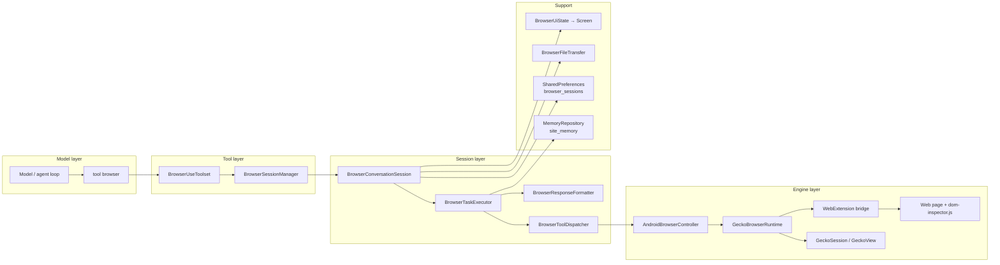

# Feature: Browser Automation (Embedded Browser Agent)

## Status

- Status: implemented (production path + debug harness); beberapa area sengaja tidak ditangani (lihat Known Limitations)
- Project: Amaya (`app/`, Android — Kotlin/Compose/GeckoView)
- Last verified: 2026-09-22 — audit source code, commit `d6ec0ef`. Tidak ada build/test/runtime yang dijalankan saat dokumentasi ini dibuat.

**Cara membaca dokumen ini:**

- `VERIFIED` — ditemukan langsung di source code pada commit di atas.
- `INFERRED` — kesimpulan logis dari implementasi, belum diverifikasi runtime.
- `UNKNOWN` — belum ditemukan / tidak dapat dipastikan dari source.
- `PROJECT-SPECIFIC` — hanya berlaku untuk Project A (Amaya) dan bukan bagian dari kontrak fitur.

Source code adalah sumber kebenaran untuk implementasi; dokumen ini adalah sumber pengetahuan untuk transfer fitur.

---

## 1. Ringkasan

Fitur ini membuat AI agent dapat **mengendalikan browser sungguhan di dalam aplikasi** (bukan sekadar mengambil HTML): membuka URL, membaca struktur halaman secara terstruktur (DOM interaktif), mengklik, mengetik, memilih opsi, scroll, upload/download file, menjalankan JavaScript, hingga mengambil screenshot — semuanya melalui satu tool model-facing bernama `browser`.

Masalah yang diselesaikan:

- Agent butuh berinteraksi dengan situs dinamis (React/SPA, login form, pencarian) yang tidak bisa ditangani `web_search` (teks saja).
- Aksi browser harus **dapat diverifikasi**: sistem mendeteksi aksi yang "sukses secara sintaks" tetapi tidak mengubah halaman (silent no-op).
- Browser harus **tetap hidup** di latar belakang Android (layar mati, app di-background, activity di-stop) selama agent bekerja.
- Percakapan/agent yang berbeda harus punya sesi browser terisolasi, dan sesi harus **pulih** setelah proses Gecko di-reclaim Android.

Setelah fitur tersedia: user dapat meminta agent menyelesaikan tugas web end-to-end (mis. membuka situs, mengisi form, menekan tombol, membaca hasil), sambil dapat **melihat dan mengambil alih** browser yang sama melalui layar Browser Operator.

## 2. Tujuan

1. Menyediakan **satu pintu tool** (`browser`) dengan banyak sub-aksi, sehingga model tidak dibanjiri tool terpisah dan mudah diajarkan lewat enum aksi + alias.
2. Menjaga **state browser per conversation/agent** (tab, riwayat, URL aktif) dan memulihkannya setelah restart.
3. Menjaga **keandalan** di lingkungan Android: proses konten Gecko sering dibunuh; sistem harus mendeteksi, lapor, dan membangun ulang sesi, bukan menunggu timeout.
4. Memberi **hasil yang ramah model**: JSON ringkas, error terstruktur + saran tindakan, sinyal "tidak ada perubahan" yang eksplisit.
5. Menyediakan **jalur manusia**: user bisa membuka browser operator, menonton agent bekerja, dan mengambil kendali (mis. menyelesaikan CAPTCHA/verifikasi manual).

## 3. Perilaku Fitur

Dari sudut pandang sistem (VERIFIED):

1. Model memanggil tool `browser` dengan `action` tunggal, atau `steps[]` (batch berurutan), atau shortcut top-level (`url`, `element_id`, `query`, `text`, `expression`).
2. Host memvalidasi: mode harus `AGENT`, `agentId` harus ada, capability `browser` milik agent harus aktif.
3. Sesi browser di-resolve berdasarkan kunci `conversation:<id>` (atau `agent:<id>`) + `agentId`. Sesi dibuat/dipulihkan (tab & history dari SharedPreferences), dan tab aktif dipastikan memiliki `GeckoSession` + bridge WebExtension yang siap.
4. Setiap step dinormalisasi (alias → aksi kanonik), dijalankan berurutan, dan hasilnya diformat menjadi sub-toolcall JSON.
5. Untuk aksi mutasi (klik, ketik, dsb.), sistem mengambil `page_fingerprint` sebelum & sesudah; jika identik, hasil sukses diberi catatan eksplisit "no observable change — action may not have taken effect".
6. Jika step memerlukan approval (upload file dari workspace), eksekusi berhenti dengan `USER_APPROVAL_REQUIRED`; setelah user menyetujui, eksekusi **dilanjutkan dari step yang sama** (bukan diulang dari awal).
7. Jika step gagal (`error`/`timeout`/`cancelled`) atau butuh approval (`paused`), sisa `steps[]` tidak dijalankan; parent task mengembalikan snapshot status + progress.
8. Hasil akhir parent task diperkaya `site_memory` (fakta workspace yang tersimpan untuk host situs aktif) agar agent memakai pengetahuan situs yang pernah dipelajari.
9. Di UI, selama turn agent berjalan di percakapan yang terlihat, teks asisten dialirkan ke panel browser (`assistantStreamText`), UI menampilkan mode "agent mengontrol" (border + overlay + sembunyikan keyboard), dan user dapat menekan layar untuk mengambil alih.
10. Screenshot terakhir dapat dilampirkan ke hasil tool sebagai gambar chat; halaman dapat terus berjalan (offscreen surface) di antara tool call.

## 4. Trigger

- **Tool call model** — dipicu model melalui tool `browser` (trigger utama). VERIFIED
- **User action** (layar Browser Operator) — tombol Back/Forward/Reload/New tab/Home, address bar `open_url`, tab switch/close, history sheet, downloads sheet, evaluate sheet, "Capture screenshot", "Clear site data", file picker upload, "Resume" setelah verifikasi manual. VERIFIED
- **Perubahan halaman (event Gecko)** — navigasi, judul, progress, scroll, download (`onExternalResponse`), file chooser (`onFilePrompt`), popup (`onNewSession`), proses konten mati (`onKill`/`onCrash`). VERIFIED
- **Lifecycle Android** — activity browser di-stop/start (`onHostVisibilityChanged`), `onTrimMemory` (rilis runtime tab non-aktif), kelaparan surface (eviction slot headless). VERIFIED
- **Streaming turn agent** — `onAssistantStreamingChanged` / `onAssistantTextDelta` dari service lokal. VERIFIED

## 5. Input

Parent tool arguments (semua opsional kecuali salah satu bentuk aksi harus ada). VERIFIED — `BrowserUseToolset.kt`, `BrowserTaskExecutor.parseSteps`.

| Input | Tipe | Wajib | Keterangan |
|---|---|---|---|
| `task` | string | tidak | Ringkasan tugas untuk user; dipertahankan selama tugas berjalan. |
| `action` | string (enum `BrowserActionCatalog.names`) | salah satu dari `action`/`steps` | Aksi browser kanonik/alias. |
| `params` | object | tidak | Parameter aksi: `url`, `page_id`, `element_id`, `selector`, `query`, `text`, `key`, `submit`, `append`, `path`/`paths`, `direction`, `amount`, `distance`, `timeout_ms`, `x`, `y`, `start_x`, `start_y`, `end_x`, `end_y`, `duration_ms`, `value`/`text`/`label` (select_option), `expression`, `delta_x`, `delta_y`. |
| `steps` | array | tidak | Batch `{action, params}`; dijalankan berurutan dalam satu parent task. |
| `reset_task` | boolean | tidak | Mulai parent task baru (bila `false` dan ada sub-toolcall, task menyambung). |
| `url` | string | tidak | Shortcut top-level `open_url`/`new_tab`. |
| `element_id` | string | tidak | Shortcut target klik/ketik; boleh `element_id`, `stable_id`, selector CSS, atau `url:<href>` dari peta elemen. |
| `query` | string | tidak | Shortcut `find_element`/`find_text`/`wait_for_element`. |
| `text` | string | tidak | Shortcut isi `type_text`. |
| `expression` | string | tidak | JavaScript untuk `action=evaluate`. |
| `path` / `paths` | string / array | tidak | File workspace (relatif) untuk `upload_file`; `paths` untuk input multiple. |
| `__confirmed` | boolean | internal | Disuntik host saat melanjutkan step upload setelah approval; model tidak mengirimnya. |

Input lingkungan (host-owned, bukan argumen model). VERIFIED — `ToolExecutionContext`:

| Input | Tipe | Wajib | Keterangan |
|---|---|---|---|
| `assistantMode` | enum | ya | Harus `AGENT`. |
| `agentId` | Long | ya | Tanpa agent aktif, tool menolak. |
| `agentCapabilityProfile.browser` | boolean | ya | Harus `true`. |
| `conversationId` | String? | tidak | Kunci sesi; fallback `agent:<agentId>`. |
| `workspacePath` | String? | untuk upload/download/screenshot | Batas file yang boleh dibaca/ditulis. |
| `toolCallId` | String? | untuk approval | Dipakai mencocokkan resume step setelah approval. |
| `confirmed` | boolean | untuk resume | Menandakan user sudah menyetujui aksi konfirmasi. |

## 6. Output

VERIFIED.

- **UI output**: layar Browser Operator (GeckoView langsung), chrome (address bar, tab, progress), dock kontrol, log aksi (`BrowserToolLog`: thinking/assistant snapshot + tool running/success/error), overlay sentuhan agent, kartu tool chat dengan sub-step sintetis per aksi.
- **Perubahan database/state**: `BrowserUiState` (sessionId, tabs, activeTabId, activeUrl/Title, progress, logs ≤120, downloads ≤50, uploadPending, screenshotBase64, evaluateResult, sessionHistory, assistantStreamText, agentTouch…); persistensi SharedPreferences (`browser_sessions`).
- **Network request**: tidak ada API jaringan milik fitur; trafik web berasal dari GeckoView saat memuat halaman.
- **Event**: panggilan balik navigasi/scroll/progress, `onAgentTouch` (posisi jari agent untuk overlay), `onError`, `onProcessGone`, `handleGeckoDownload`.
- **Tool result**: JSON parent task (`type=parent_toolcall`, `status`, `progress`, `sub_toolcalls[]`, opsional `site`+`site_memory`) + lampiran `bridge_image_base64` (JPEG) bila ada screenshot; sub-toolcall JSON (`success|error|cancelled` + `error.code` + `suggested_action`).
- **File**: upload dari workspace (dibaca, dikirim ke halaman sebagai `File` via `DataTransfer`); download ke `<workspace>/.amaya/browser/downloads/`; screenshot ke `<workspace>/.amaya/browser/screenshots/`; staging upload user ke `<workspace>/.amaya/browser/uploads/`.
- **Perubahan state**: `BrowserAgentStatus` (`IDLE/THINKING/BROWSING/CANCELLED/ERROR/COMPLETED`), progress step, pending approval checkpoint, `pendingRestoreUrl`.

Contoh bentuk sub-toolcall (disederhanakan, VERIFIED — `BrowserResponseFormatter.subToolResponse`):

```json
{
  "id": "call_ab12cd34",
  "parent_call_id": "browser_task_...",
  "tool": "browser.click",
  "status": "success",
  "duration_ms": 412,
  "session": { "session_id": "sess_android_...", "browser_id": "browser_local_001",
                "active_page_id": "...", "pages": [ { "page_id": "...", "active": true } ] },
  "request": { "params": { "element_id": "el_button_3" } },
  "result": { "message": "Clicked element; page_changed=true", "page_changed": true,
              "outcome": "navigation", "requires_postcondition_check": true },
  "safety": { "sensitive_detected": false, "requires_user_decision": false, "allowed_next_actions": [] },
  "ui": { "summary": "Clicked element; page_changed=true", "agent_status": "idle", "expandable": true },
  "error": null
}
```

## 7. Alur Kerja

```mermaid
flowchart TD
    A[Model call tool browser] --> B{Gate: AGENT mode +<br/>agentId + capability.browser}
    B -->|tidak| Z1[Parent JSON status=error]
    B -->|ya| C[Resolve sesi per conversation+agent<br/>restore tabs/history dari persisten]
    C --> D[Pastikan GeckoSession + bridge siap<br/>attach/reload/probe stale/rebuild bila perlu]
    D --> E[Parse steps: action+params / steps[] / shortcut]
    E --> F[Loop step berurutan]
    F --> G[Baca page_fingerprint sebelum aksi mutasi]
    G --> H[Eksekusi aksi via dispatcher/DOM/controller]
    H --> I{Aksi butuh approval?}
    I -->|ya| J[Berhenti: status=paused<br/>USER_APPROVAL_REQUIRED + step index]
    I -->|tidak| K{Bandingkan fingerprint sesudah}
    K -->|berubah| L[status=success]
    K -->|identik| M[status=success + catatan<br/>'no observable change']
    L --> N{status error/timeout/cancelled?}
    M --> N
    N -->|ya| O[Stop, parent snapshot]
    N -->|tidak| F
    O --> P[Parent JSON + progress + sub_toolcalls<br/>+ site_memory]
    J --> Q[User Approve di host]
    Q --> R[Re-invoke dengan confirmed=true<br/>resume dari step index]
    R --> F
```

Penjelasan tahap:

1. **Gate** (VERIFIED): `executeBrowserTask` menolak bila bukan `AGENT`, capability browser off, atau tidak ada agent; tool juga tidak diadvertise di mode CHAT/PROJECT.
2. **Resolve sesi** (VERIFIED): kunci `conversation:<id>`/`agent:<id>` + agentId; `resetForConversation` memuat tab/history/URL dari SharedPreferences dan menyiapkan `pendingRestoreUrl`.
3. **Pastikan runtime** (VERIFIED): `ensureController()` → `ensureSharedControllerOnMain()` (buat GeckoSession/GeckoView untuk tab aktif) + `attachHeadlessSurfaceOnMain()` (surface offscreen 1080×1920) + `GeckoBrowserRuntime.attach()`; bila proses konten mati atau bridge stale → `recoverActiveRuntime()` (rebuild session tab, buka ulang URL).
4. **Parse step** (VERIFIED): `steps[]` iterable atau satu aksi; nama dinormalisasi lewat alias.
5. **Fingerprint** (VERIFIED — Scheme G): hanya untuk daftar aksi mutasi; kegagalan membaca fingerprint melewati verifikasi (tidak menghasilkan false positive).
6. **Eksekusi** (VERIFIED): `execute(action)` → log/UI state → `executeBrowserTool` (dispatcher) kecuali `cancel_action`. Sebagian aksi punya strategi bertingkat: klik = native tap → DOM click → direct open href; ketik = DOM value setter/events → native GeckoView input connection; scroll = DOM nested scroll; dsb.
7. **Approval checkpoint** (VERIFIED): sub hasil dengan `USER_APPROVAL_REQUIRED` menyimpan `pendingApprovalCallId` + `pendingApprovalStepIndex`; step berikutnya dalam batch tidak berjalan; parent kembali `paused`.
8. **Resume** (VERIFIED): panggilan ulang dengan `confirmed=true` dan `toolCallId` yang sama melewati step sebelum `pendingApprovalStepIndex` (tanpa mengulang efek samping) dan menyuntik `__confirmed=true`.
9. **Finalisasi** (VERIFIED): snapshot parent + `site_memory` dari `MemoryRepository` (fakta WORKSPACE_FACT yang cocok host URL aktif, maksimal 4).

## 8. Komponen yang Terlibat

| Komponen | Peran | Project Reference |
|---|---|---|
| `BrowserUseToolset` | Wrapper tool parent `browser`, schema model, approval extraction, lampiran screenshot | `app/src/main/java/com/amaya/intelligence/tools/BrowserUseToolset.kt` |
| `DefaultAgentToolRegistry` | Registrasi tool + gating mode/capability | `app/src/main/java/com/amaya/intelligence/tools/DefaultAgentToolRegistry.kt` |
| `assistantModeAllowsCapability` / `exposeToolDefinition` | Kebijakan mode (browser tidak untuk CHAT/PROJECT) | `app/src/main/java/com/amaya/intelligence/tools/ToolExecutor.kt` |
| `BrowserSessionManager` | Registry sesi per conversation+agent, LRU, wake-lock, shared view, operator ownership | `impl/local/browser/BrowserSessionManager.kt` |
| `BrowserConversationSession` | State per sesi, GeckoSession per tab, surface offscreen, log UI | `impl/local/browser/BrowserConversationSession.kt` |
| `BrowserConversationState` | Lifecycle sesi, restore, upload/download, persistence extensions | `impl/local/browser/BrowserConversationState.kt` |
| `BrowserTaskExecutor` | Parsing parent task, batch step, approval resume, verifikasi aksi (Scheme G), site memory | `impl/local/browser/BrowserTaskExecutor.kt` |
| `BrowserToolDispatcher` | Dispatch aksi → controller/DOM | `impl/local/browser/BrowserToolDispatcher.kt` |
| `BrowserDomActions` | Aksi & verifikasi berbasis DOM, submit/search/scroll/upload primitives | `impl/local/browser/BrowserDomActions.kt` |
| `AndroidBrowserController` | Delegate Gecko, tunggu navigasi, tap/swipe native, evaluate, screenshot, file chooser | `impl/local/browser/AndroidBrowserController.kt` |
| `GeckoBrowserRuntime` | GeckoRuntime proses-tunggal + bridge WebExtension, readiness/stale/gone/recovery | `impl/local/browser/GeckoBrowserRuntime.kt` |
| `DomInspector` | Pembangun script DOM bertipe (escape nilai dinamis) | `impl/local/browser/DomInspector.kt` |
| `assets/browser-bridge/*` | WebExtension: `manifest.json`, `bridge.js` (content script), `dom-inspector.js` (template) | `app/src/main/assets/browser-bridge/` |
| `BrowserFileTransfer` | Upload workspace→halaman & validasi accept/multiple | `impl/local/browser/BrowserFileTransfer.kt` |
| `BrowserResponseFormatter` | Protokol JSON parent/sub, kompaksi hasil, mapping error | `impl/local/browser/BrowserResponseFormatter.kt` |
| `BrowserSessionPersistence` | Codec SharedPreferences (tabs/history/active) | `impl/local/browser/BrowserSessionPersistence.kt` |
| `BrowserRuntimeLimits` | Batas timeout/ukuran/viewport | `impl/local/browser/BrowserRuntimeLimits.kt` |
| `BrowserActionCatalog` | Daftar aksi yang diekspos ke model (enum schema) | `impl/local/browser/BrowserActionCatalog.kt` |
| `SafetyGuard` | Dokumentasi kebijakan input browser (tanpa gating kredensial) | `impl/local/browser/SafetyGuard.kt` |
| `BrowserArgumentReader` | Pembacaan argumen bertipe dari model | `impl/local/browser/BrowserArgumentReader.kt` |
| `BrowserModels` | `BrowserUiState`, tab, log, download, response sealed class | `impl/local/browser/BrowserModels.kt` |
| `BrowserAssistantStream` | Proyeksi streaming asisten ke panel browser | `impl/local/browser/BrowserAssistantStream.kt` |
| `BrowserOperatorActivity` / `BrowserOperatorScreen` / `BrowserControlDock` | UI operator (GeckoView fullscreen, chrome, dock, sheet) | `ui/activities/browser/`, `ui/screens/browser/` |
| `BrowserToolUiParser` | Sintesis sub-step browser menjadi kartu tool di chat | `ui/components/shared/BrowserToolUiParser.kt` |
| `BrowserDebugActivity` | Harness debug ADB (suite aksi, manager-headless, restore, real-web stress) | `app/src/debug/java/com/amaya/intelligence/ui/activities/browser/BrowserDebugActivity.kt` |
| `BrowserEvaluatePolicyTest` | Unit test JVM: memastikan tidak ada allowlist script evaluate (cek source) | `app/src/test/java/com/amaya/intelligence/impl/local/browser/BrowserEvaluatePolicyTest.kt` |

## 9. Arsitektur



Pemisahan lapisan (VERIFIED):

- **UI**: `BrowserOperatorScreen` + `BrowserControlDock` menampilkan `BrowserUiState`; activity menyediakan file picker Android dan pembukaan download via FileProvider.
- **Domain/business logic**: task execution (step, approval, verifikasi), normalisasi alias aksi, kebijakan batas ukuran.
- **Data**: `BrowserSessionPersistence` (SharedPreferences) + `BrowserUiState` in-memory; `MemoryRepository` untuk site memory.
- **Network**: GeckoView/GeckoRuntime (satu runtime proses, banyak GeckoSession).
- **Storage**: workspace di `<workspace>/.amaya/browser/{uploads,downloads,screenshots}`.
- **Background process**: surface offscreen + `PARTIAL_WAKE_LOCK` (`amaya:browser-agent`, timeout 60s per task) menjaga page hidup saat app tidak foreground.
- **External service**: situs web apa pun (WebExtension content script berjalan di semua URL).
- **AI/model**: model memilih aksi lewat schema; sistem tidak memanggil model sendiri.
- **Tools**: satu tool parent; sub-aksi bukan tool terpisah (tidak ada `execute_javascript`, `run_javascript`, dsb di schema).
- **Permissions**: prompt permission Android dari situs **selalu ditolak** (`callback.reject()`, content permission `VALUE_DENY`); popup/new session **selalu diblokir** (`onNewSession` → `null` + pesan error).

## 10. Data dan State

Aliran data (VERIFIED):

```
Model args (action/params/steps)
   ↓
ToolExecutionContext (host-owned)
   ↓
BrowserConversationSession (uiState + pageRuntimes per tab)
   ↓
GeckoSession (+ bridge evaluate)
   ↓
Sub-toolcall JSON (result + error)
   ↓
Parent task JSON (+ site_memory) → tool result → chat/browser UI
```

State utama (`BrowserUiState`, VERIFIED):

- Identitas: `sessionId` (deterministik dari conversation+agent), `browserId` (`browser_local_001`), `conversationKey`, `agentId`.
- Navigasi: `activeUrl`, `activeTitle`, `activeTabId`, `tabs` (id, title, url, canGoBack/Forward, scrollX/Y), `sessionHistory` (≤60), `progress`.
- Operasional: `status`, `currentAction`, `progress`, `logs` (≤120), `lastError`, `isCancelled`.
- Upload/download: `uploadPending`, `uploadAcceptTypes`, `uploadRequestNonce`, `downloads` (≤50).
- Streaming: `assistantStreamText` (≤4000 char), `assistantStreamUpdatedAt`, `isAssistantStreaming`, `browserAccessActive`.
- Overlay: `agentTouchX/Y`, `agentTouchNonce`.

Entity persistensi (SharedPreferences `browser_sessions`, VERIFIED — `BrowserSessionPersistence`):

| Key | Isi | Lifecycle |
|---|---|---|
| `<sessionId>.tabs` | JSON array tab (id, title, url, can_go_back/forward, scroll_x/y) | Ditulis saat navigasi/scroll/tab berubah; dibaca saat `resetForConversation`. |
| `<sessionId>.history` | JSON array `{url,title,visited_at}` | Maks 60 entri terakhir; dibaca saat restore. |
| `<sessionId>.active_url` / `.active_title` | URL/judul aktif terakhir | Dipakai `pendingRestoreUrl` saat sesi dibangun ulang. |
| `<sessionId>.active_tab_id` | Tab aktif terakhir | Divalidasi terhadap daftar tab saat restore. |

Lifecycle data lain:

- `pendingRestoreUrl` di-hydrate saat aksi DOM pertama (kecuali `open_url`/`new_page`/`new_tab`/`get_status`/`list_pages`) atau saat view operator di-acquire dengan URL masih `about:blank`.
- Download & screenshot ditulis ke workspace (file nyata), entri UI disimpan di memori sesi (bukan persisten).
- `pendingApprovalCallId`/`pendingApprovalStepIndex` adalah state in-memory sesi; hilang saat sesi dibuang → approval tidak bisa di-resume (fail-closed).
- Cookies/profil Gecko: memakai `GeckoRuntime` default aplikasi (satu profil proses). Apakah cookies bertahan lintas restart adalah INFERRED (Gecko default menyimpan profil di data app), bukan hasil verifikasi runtime.
- Tidak ada migrasi skema; SharedPreferences hanya codec JSON dengan toleransi `runCatching` (korup → daftar kosong).

## 11. Dependencies

**Internal (wajib):**

- `BrowserUiState`/`BrowserPageTab`/`BrowserToolResponse` (model internal).
- Coroutines Kotlin (`Dispatchers.Main.immediate`, `Mutex`, `Semaphore`, `withTimeout`).
- `org.json` (JSONObject/JSONArray).
- Host tool layer: `Tool`, `ContextAwareTool`, `ToolResult`, `ToolExecutionContext`, `ToolDefinition`/`ToolParameter`.
- Gating: `AssistantMode`, `AgentCapabilityProfile`, `CapabilityToolGroups`.
- AndroidX `FileProvider` (download/open file), `PowerManager` wake lock, `ImageReader`/`GeckoDisplay` (surface offscreen).

**Internal (opsional / dapat diganti):**

- `MemoryRepository` untuk `site_memory` (jika tidak ada, parent JSON tetap valid tanpa `site`).
- `debugLog`/`Log` util.
- Hilt DI (cara wiring di Amaya; bukan kontrak fitur).
- Compose UI operator & kartu chat (bukan kontrak fitur).

**External (wajib):**

- **GeckoView** (`org.mozilla.geckoview:geckoview-omni` di Project A) — engine browser + WebExtension API (`WebExtension.MessageDelegate`, `Port`, `GeckoSession`, `GeckoView`, `GeckoRuntime`, `StorageController`).
- Runtime Android dengan WebExtension/content-script support (GeckoView built-in extension).
- `kotlinx-coroutines`, `org.json`, AndroidX Core.

**External (opsional):**

- `MimeTypeMap`/`URLUtil` (optimasi nama file upload/download; mudah diganti).
- CameraX/MLKit dsb **tidak** dibutuhkan fitur ini.

Kontrak WebExtension→native yang harus dipertahankan (VERIFIED):

- Extension id `browser-bridge@amaya.local`, app/native port `browser_bridge`.
- Content script `bridge.js` pada `document_start`, `all_frames:false`, `matches: <all_urls>`.
- Pesan native: `{id, script}` → balasan `{id, ok, value|error}`; pesan pertama `{type:"ready", href}`.
- Protocol evaluasi: native `postMessage({id, script})`; page membalas satu kali.

## 12. Configuration

- **Environment variables**: tidak ada. Fitur browser tidak memakai API key (browser berjalan lokal di perangkat). VERIFIED
- **Feature flag**: capability per-agent `browser` (bagian `AgentCapabilityProfile`, encode `browser=true|false`) + mode percakapan harus `AGENT`. Di UI Agent Config, kategori ini ditampilkan group `CapabilityToolGroups.browser = ["browser"]`.
- **Config file / build**: dependency GeckoView di `app/build.gradle.kts`; asset bridge berada di `app/src/main/assets/browser-bridge/` dan di-load sebagai built-in extension `resource://android/assets/browser-bridge/`; repository Maven Mozilla (`settings.gradle.kts`).
- **Permission Android**: aktivitas `BrowserOperatorActivity` (`exported=false`), `FileProvider` authority `${applicationId}.fileprovider` dengan `file_paths` XML. Tidak ada permission baru khusus fitur (jaringan normal aplikasi).
- **Runtime configuration**: `BrowserRuntimeLimits` (timeout navigasi 30s, evaluasi 10s, DOM 50k, HTML 200k, viewport 1080×1920); wake-lock timeout 60s; slot surface offscreen = 2; sesi resident maks 6; tab per sesi maks 8.
- **File paths runtime**: `<workspace>/.amaya/browser/{uploads,downloads,screenshots}`; SharedPreferences `browser_sessions`.
- **Debug harness**: `BrowserDebugActivity` memilih mode dari intent extra `mode` (`visible`, `manager-headless`, `restore-seed`, `restore-check`, `real-web`, `real-web-stress`, `real-web-ux`, default suite headless); `scripts/run-debug-cycles.ps1` memakai env `ANDROID_SERIAL` (default `emulator-5556`).

Jangan menyimpan secret/credential dalam konfigurasi fitur — tidak ada yang dibutuhkan.

## 13. Error Handling

VERIFIED — mekanisme yang ada:

- **Network error / page gagal dimuat**: `onPageStop(success=false)` → `onError("Network/browser error while loading …")`; aksi tunggu mengembalikan `BrowserToolResponse.Failure` (kode `NETWORK_ERROR`).
- **Timeout navigasi**: `waitForPage`/`waitForHistoryNavigation` dengan `withTimeout` → failure pesan "Page load timed out…" / "History navigation timed out…" (`TIMEOUT`, recoverable).
- **Bridge tidak menjawab (TimeoutCancellationException / "document navigated")**: evaluasi gagal; aksi DOM penting melakukan retry terbatas (getDom 3 percobaan dengan `awaitReady` + backoff); `waitForDomReady`/`waitForInteractionSettle` memakai polling.
- **Proses konten mati/crash** (`onKill`/`onCrash`): `markProcessGone`, port dibuang, semua pending eval di-fail; aksi berikutnya memicu `recoverActiveRuntime()` (rebuild sesi + reload URL) — bukan timeout. Jika rebuild tetap gagal: `BridgeUnrecoverable`.
- **Bridge stale** (port lama yang tidak putus resmi): probe liveness `evaluate("1", 2s)` bila tidak ada balasan ≥3s; hasil gagal → dianggap stale → rebuild.
- **Input tidak valid**: pesan failure spesifik + `error.code` mapping (`MISSING_QUERY`, `MISSING_TARGET`, `ELEMENT_NOT_FOUND`, `BROWSER_ACTION_FAILED`) + `suggested_action` (mis. `use_element_id_from_agent_interactive_elements`). Untuk aksi yang butuh target, kegagalan menyertakan hasil `get_dom` di metadata agar model bisa memilih elemen lain.
- **Elemen tidak terlihat/disabled/tertutup elemen lain**: preflight klik mengembalikan failure dengan `blocker` + `element`; jika ada `href` yang aman, sistem membuka URL langsung (`direct_open_href`) dan menolak rute embedded app (`x.com/i/jf/`).
- **Silent no-op**: fingerprint sama → sukses + catatan "[verification] No observable page change…"; ketik/gulir/hapus field juga diverifikasi state sebelum/sesudah.
- **Popup**: `onNewSession` diblokir → `popupVersion++` → klik mengembalikan failure "Popup blocked; click outcome requires inspection" (agar model tidak salah menganggap gagal total).
- **Permission Android dari situs**: langsung ditolak + pesan (`ANDROID_PERMISSION_PROMPT`).
- **Upload**: file di luar workspace / bukan file / tidak cocok `accept` → failure sebelum eksekusi; file chooser tidak terbuka → failure recoverable; approval wajib → `USER_APPROVAL_REQUIRED` + resume.
- **Download**: body hilang → error; duplikat callback dalam 1 detik diabaikan (dedupe); tanpa workspace → "Download blocked: select a workspace first".
- **Cancellation**: `cancel_action` / tombol stop → `controller.cancel()` (`session.stop()`), status `CANCELLED`, failure `recoverable=false` memetakan status sub ke `cancelled`; `isCancelled` di UI.
- **DB failure**: tidak ada database untuk fitur ini; SharedPreferences korup ditoleransi (`runCatching` → kosong).
- **Crash proses app**: state tab/history/URL dipersistenkan sehingga sesi bisa dibangun ulang; approval pending hilang (fail-closed).

Retry policy: retry hanya untuk kondisi transient bridge (DOM read, findText, clearInput sekali ulang); aksi mutasi tidak di-retry otomatis setelah efek terlihat.

## 14. Edge Cases

VERIFIED (kondisi yang ditangani eksplisit di source):

- Halaman masih memuat saat aksi dipanggil → `waitForDomReady`/`waitForInteractionSettle` + polling; kegagalan fingerprint dilewati (skip verifikasi).
- Aksi DOM dipanggil sebelum GeckoView mounted (mis. turn terdelegasi) → `attach` dengan reload bila perlu.
- SPA tanpa navigasi dokumen (History API) → `waitForHistoryNavigation` memberi settle 300ms untuk callback state/title.
- Tab dihapus saat callback navigasi Gecko menyusul → callback diabaikan (`tabs.none { id }`).
- Tab background kehilangan bridge → `switchTab` melakukan `attach(reloadIfNeeded=true)` sebelum aksi DOM berikutnya.
- Batas tab (8): tab tertua non-aktif dihapus, runtime-nya ditutup.
- Sesi melebihi 6: LRU membuang sesi non-visible/non-shared-view/tidak sedang eksekusi.
- Surface offscreen penuh (2 slot): slot milik sesi idle di-evict; jika gagal, aksi tetap berjalan tanpa offscreen display (page tetap bisa di-reclaim).
- Dua percakapan berjalan paralel dengan agent berbeda → sesi terpisah (mutex per sesi, bukan global); sesi paralel tidak saling menimpa `visibleKey`.
- User membuka operator lain saat task berjalan → `sharedViewOwner` berpindah; sesi sebelumnya melepas shared view; owner lama tidak di-trim saat executing.
- Host activity di-stop tanpa kehilangan surface → tetap `setActive(true)` + priority high; bila surface benar-benar hilang → pindah ke offscreen display.
- Upload dipilih user sebelum `fileChooserCallback` datang (race satu main-loop) → keputusan di-queue (`queuedUploadDecision`).
- Upload agent selesai via `DataTransfer` → fallback ke file chooser native + `queuedUploadUris` bila verifikasi nama file gagal.
- Download duplikat (callback ganda) → dedupe 1 detik.
- Request/state hilang setelah restart → `pendingRestoreUrl` + tab restore; aksi pertama yang bukan navigasi menghidrate URL.
- `switch_tab` ke tab yang belum punya runtime → runtime dibuat & di-attach; URL di-load ulang bila masih `about:blank`.
- `type_text` tanpa selector → menulis ke `document.activeElement` (field keyboard eksternal di luar viewport tetap valid).
- Keluar dari app saat task berjalan → wake-lock (≤60s) + surface offscreen menjaga proses; setelah batas, OS boleh membunuh (dan aksi berikutnya memicu recovery).
- Evaluate hasil >64KB → failure terkontrol, bukan crash.
- Aksi `cancel_action` di tengah batch → menghentikan task dengan status `cancelled`.

## 15. Lifecycle

Sesi (VERIFIED):

```
Created (sessionFor / restoreForConversation)
   ↓
Initialized (GeckoSession.open, bridge attach, tab restore)
   ↓
Running (execute / executeBrowserTask: BROWSING)
   ├── Success → IDLE (currentAction "Completed …")
   ├── Paused (approval) → resume setelah confirmed
   ├── Cancelled (stop/cancel_action) → CANCELLED
   ├── Error (recoverable) → ERROR
   └── Process gone / stale bridge → Rebuild (reinit tab) → Running lagi
   ↓
Completed (parent task status=completed)
   ↓
Resident (di LRU, bisa di-trim) → Closed (session.close(): runtime/tab dibuang)
```

Parent task status: `running → completed | paused | cancelled | error`. Sub status: `success | error | cancelled`; `paused` muncul di parent saat ada `USER_APPROVAL_REQUIRED`.

Refresh/rebuild: `resetForConversation` (kunci berubah), `recoverActiveRuntime` (proses mati/stale), `releaseInactiveRuntimes` (trim tab non-aktif, dipanggil `onTrimMemory ≥ 10`).

## 16. Implementasi Project Asal

Ringkasan file/kelas/fungsi (semua path di `app/src/main/java/com/amaya/intelligence/` kecuali disebut lain):

- Tool & gating: `tools/BrowserUseToolset.kt` (`getToolDefinitions`, `BrowserTool.execute`), `tools/DefaultAgentToolRegistry.kt` (registrasi), `tools/ToolExecutor.kt` (`assistantModeAllowsCapability`, `PROJECT_DISABLED_CAPABILITIES`).
- Manajemen sesi: `impl/local/browser/BrowserSessionManager.kt` (`executeBrowserTask`, `selectConversation`, `acquireSharedBrowserView`, `trimSessions`), `BrowserConversationSession.kt` (`ensureController`, `ensureSharedControllerOnMain`, `recoverActiveRuntime`, `attachHeadlessSurfaceOnMain`, `createTab`, `switchTab`, `closeActiveTab`), `BrowserConversationState.kt` (`resetForConversation`, `handleGeckoDownload`, `provideUploadUris`, `captureScreenshotToWorkspace`).
- Eksekusi: `BrowserTaskExecutor.kt` (`executeBrowserTask`, `executeNormalizedSubtool`, `normalizeActionName`, `attachActionVerification`, `parentTaskJsonWithSiteMemory`), `BrowserToolDispatcher.kt` (`executeBrowserTool`), `BrowserDomActions.kt` (`click`, `typeText`, `search`, `scrollPage`, `evaluate`, `screenshot`, …), `BrowserFileTransfer.kt` (`uploadWorkspaceFiles`).
- Engine: `GeckoBrowserRuntime.kt` (`attach`, `evaluate`, `awaitReady`, `isBridgeStale`, `markProcessGone`, `ensureExtension`), `AndroidBrowserController.kt` (`configureGecko`, `waitForPage`, `dispatchTap`, `dispatchSwipe`, `nativeTypeText`, `openFileChooser`), `DomInspector.kt` (script builder), `assets/browser-bridge/{manifest.json,bridge.js,dom-inspector.js}`.
- Protokol & state: `BrowserResponseFormatter.kt`, `BrowserModels.kt`, `BrowserSessionPersistence.kt`, `BrowserRuntimeLimits.kt`, `BrowserActionCatalog.kt`, `BrowserAssistantStream.kt`, `SafetyGuard.kt`.
- UI: `ui/activities/browser/BrowserOperatorActivity.kt`, `ui/screens/browser/{BrowserOperatorScreen,BrowserControlDock,BrowserPresentation}.kt`, `ui/components/shared/BrowserToolUiParser.kt`, integrasi chat di `ui/screens/chat/shared/ChatScreen.kt` (menu agent → buka operator) dan hook streaming di `impl/local/{LocalTurnStart,LocalTurnProjection}.kt`.
- Debug/test: `app/src/debug/.../BrowserDebugActivity.kt`, `app/src/test/.../BrowserEvaluatePolicyTest.kt`, `scripts/run-debug-cycles.ps1`.

Jangan menyalin source code; gunakan referensi ini sebagai peta implementasi.

## 17. Hal yang Bersifat Project-Specific

PROJECT-SPECIFIC — agent yang memindahkan fitur harus menganggap ini referensi, bukan syarat:

- **GeckoView/GeckoRuntime** sebagai engine (bisa diganti WebView/Chromium/Playwright/Electron selama kontrak WebExtension-like diganti mekanisme eksekusi script yang setara).
- **Android + Compose + Hilt + SharedPreferences + FileProvider + WorkManager-free design**.
- Nama kelas/paket/`browser_local_001`, format `sess_android_*`, `browser_task_*`, `call_*`.
- Skema JSON parent/sub-toolcall yang khas Amaya (nama field bisa disesuaikan project target selama informasi yang sama tersedia).
- `MemoryRepository`/site memory, `AgentCapabilityProfile`, mode `AGENT`, `ToolExecutionContext` — struktur host Amaya.
- Layar operator, tema iOS-like, kartu chat Compose.
- Debug harness ADB dan `run-debug-cycles.ps1` (PowerShell, emulator `emulator-5556`).
- Rute embedded app khusus (`x.com/i/jf/`) dan peta elemen khusus situs tertentu (data-testid, `cellInnerDiv`, dsb.).
- Kebijakan `SafetyGuard` (input sepenuhnya bebas, tanpa gating kredensial/OTP) — kontrak perilaku, tapi keputusan produk milik Project A.

## 18. Kontrak Fitur

MUST (harus dipertahankan pada reimplementasi):

- Satu tool model-facing dengan banyak sub-aksi; aksi dijalankan **berurutan** dan hasil tiap aksi dikembalikan ke model sebagai hasil tool (bukan hanya status akhir).
- Gating eksekusi: mode/capability/agent divalidasi di host, bukan hanya di schema; tanpa agent aktif → error terkontrol.
- State browser terisolasi per conversation/agent, dan **identitas sesi stabil** untuk conversation+agent yang sama.
- Aksi mutasi diverifikasi terhadap perubahan halaman; no-op eksplisit dilaporkan, bukan diklaim sukses.
- Elemen target berbasis identitas stabil (`element_id`/`stable_id`/peta elemen/selector) yang bertahan antar observasi.
- Aksi harus bekerja **tanpa host UI terlihat** (headless/offscreen) dan tidak boleh kehilangan page hanya karena app background — page boleh di-reclaim OS, tetapi sistem harus membangun ulang dan melanjutkan dari URL tersimpan.
- Proses konten mati/stale harus terdeteksi cepat dan memicu rebuild; tidak boleh menunggu timeout aksi demi timeout aksi.
- Setiap failure membawa pesan + kode + recoverability; kegagalan target menyertakan konteks DOM agar model dapat memperbaiki diri.
- Aksi berkonsekuensi (memilih file workspace untuk web form) wajib approval host, dan resume tidak boleh mengulang efek samping step sebelumnya.
- File hanya boleh dibaca/ditulis di dalam workspace yang aktif (validasi kanonik path).

SHOULD:

- Deteksi dini kondisi stale (liveness probe) selain event disconnect.
- Dedupe download ganda dan race file-chooser.
- Fallback strategi aksi (native → DOM → direct href; DOM typing → native input connection; DataTransfer → native chooser).
- Kembalikan `site_memory`/konteks situs yang dapat dipakai ulang.
- Log aksi ringkas + status untuk observasi user.
- Batas keras untuk ukuran output (DOM/HTML/evaluate) dan jumlah entri log.

MAY:

- Pilihan engine browser, format persistensi, mekanisme surface/background, struktur UI, mekanisme site memory, format JSON persisnya.

## 19. Acceptance Criteria

Uji perilaku (bukan keberadaan kelas):

- [ ] Model dapat membuka URL dan menerima hasil navigasi berisi URL/title final (bukan echo request).
- [ ] Model dapat membaca halaman terstruktur (elemen interaktif dengan identitas stabil + bounds) dan menggunakannya untuk aksi berikutnya.
- [ ] Klik yang mengubah halaman melaporkan perubahan; klik yang **tidak** berefek melaporkan "no observable change" (atau failure), bukan sukses tanpa catatan.
- [ ] `type_text` di form React (controlled input) benar-benar mengubah nilai field; bila tidak, sistem melaporkan gagal, bukan sukses palsu.
- [ ] Submit form berhasil lewat tombol terkait/form requestSubmit, atau Enter fallback.
- [ ] Upload file workspace menunggu approval; setelah approve, step sebelum upload **tidak** diulang dan file terpasang di input (nama file cocok).
- [ ] Download attachment tersimpan sekali di workspace dan tidak terduplikasi saat callback Gecko ganda.
- [ ] Popup dan permission request situs ditolak dengan pesan yang dapat ditindaklanjuti dan tidak menggagalkan seluruh sesi.
- [ ] Setelah proses konten Gecko mati, aksi berikutnya membangun ulang sesi dan melanjutkan dari URL yang sama (bukan error permanen).
- [ ] Dua percakapan/agent dapat menjalankan tugas browser paralel tanpa mencampur session id, tab, atau URL.
- [ ] Setelah app/process restart, tab/history/URL aktif pulih dan aksi berikutnya memuat halaman tersebut.
- [ ] Saat turn agent berjalan di latar belakang, browser tetap dapat menyelesaikan aksi (page tidak hilang) atau dipulihkan otomatis.
- [ ] Cancellation menghentikan aksi berjalan, menandai status cancelled, dan tidak menjalankan step berikutnya.
- [ ] `evaluate` hasil besar/berat dibatasi (timeout, ukuran) tanpa menggantung turn.
- [ ] Tool tidak tersedia di mode selain AGENT dan saat capability browser agent dimatikan.

## 20. Migration / Adaptation Guide

**Source Project:** Project A (Amaya — Android, Kotlin, Compose, GeckoView).

**Target Concept:** Agent AI yang mengendalikan browser embedded untuk menyelesaikan tugas web interaktif, dengan sesi per percakapan, verifikasi aksi, approval, dan pemulihan otomatis.

**Required Components:**

1. Engine browser embedded yang dapat mengeksekusi script di halaman dan menunggu event navigasi (GeckoView/WebView/CDP).
2. Jembatan eksekusi script + readiness handshake (versi minimal: request/response ber-id, sinyal "ready", deteksi "document navigated").
3. Registry sesi per conversation/agent + identitas sesi stabil.
4. Eksekutor step berurutan dengan status hasil per step (sukses/error/paused/cancelled + kode error).
5. Lapisan observasi DOM yang menghasilkan elemen dengan identitas stabil (el id/hash/selector) dan bounds/actionability.
6. Verifikasi aksi (fingerprint sebelum/sesudah minimal URL+title+panjang teks+focus/value).
7. Mekanisme lapor "no observable change" + error terstruktur dengan saran.
8. Persistensi ringan tab/history/URL + jalur pemulihan rebuild.
9. Approval host untuk aksi berkonsekuensi + checkpoint resume.
10. Akses file workspace yang dibatasi (kanonik, hanya di dalam root).
11. Telemetri/status untuk UI (opsional tapi disarankan).

**Components That Can Be Replaced:**

- Engine & surface management (offscreen/headless berbeda per platform).
- Format persistensi (DB/preferences/file).
- UI framework & protokol JSON persis.
- Site memory (bisa tanpa repository apa pun).
- Wake-lock/foreground service: ganti mekanisme keep-alive sesuai OS target.
- Nama kelas/folder.

**Components That Must Preserve Their Behavior:**

- Gating eksekusi + isolasi sesi per conversation/agent.
- Urutan step + data hasil per step dikembalikan ke model.
- Verifikasi mutasi + pelaporan no-op eksplisit.
- Deteksi proses mati/stale → rebuild dan lanjut dari URL tersimpan.
- Approval checkpoint yang tidak mengulang efek samping sebelumnya.
- Validasi path workspace.
- Penanganan popup/permission yang aman dan dapat ditindaklanjuti.

**Suggested Implementation Order:**

1. Engine + eksekusi script + event navigasi.
2. Jembatan id-protocol + readiness/stale detection.
3. Registry sesi + persistensi tab/history/URL.
4. Observasi DOM + identitas elemen.
5. Eksekutor aksi (navigasi, klik, ketik, scroll, find/wait).
6. Verifikasi aksi + pelaporan no-op.
7. Approval + resume + upload/download.
8. UI/status (opsional).
9. Pemulihan proses mati + edge case concurrency.
10. Tests + acceptance criteria.

**Agent target tidak boleh** menganggap struktur folder, nama kelas, library, database, atau framework Project A sebagai keharusan; hanya kontrak perilaku yang mengikat.

## 21. Known Limitations

VERIFIED dari source (bukan daftar spec):

- Browser hanya untuk mode `AGENT` dengan agent aktif + capability `browser` aktif; CHAT/PROJECT tidak mendapat tool ini.
- Halaman CAPTCHA/challenge tidak dengar penanganan khusus; tidak ada pause/otomasi khusus (hanya aksi browser biasa).
- Popup/new window selalu diblokir (`onNewSession → null`); navigasi popup harus diambil alih model (mis. `open_url` langsung).
- Permission Android dari situs selalu ditolak; verifikasi yang butuh permission native tidak bisa diselesaikan agent.
- `evaluate` dibatasi timeout maksimum 10s dan hasil 64KB; DOM 50KB; HTML 200KB.
- Persistensi hanya tab/history/URL — bukan state form, cookie eksplisit, atau DOM (perilaku cookie lintas restart: INFERRED, ikut profil Gecko).
- Maks 8 tab per sesi, 6 sesi resident; tab tersisa di luar itu dibuang (tanpa notifikasi ke model selain respons `switch_page` gagal).
- Screenshot bergantung pada `capturePixels`/display; kualitas JPEG 82, tanpa kontrol.
- `redactParams` saat ini **identity** (tidak menyamarkan nilai); metadata hanya menandai field sensitif. `SafetyGuard` memang menyatakan input browser tidak dibatasi (kredensial/OTP boleh diisi) — keputusan produk Project A.
- Cross-frame/iframe: content script hanya main frame; aksi dalam iframe bergantung pada akses DOM/summary, bukan kendali frame penuh.
- Proses yang dibunuh saat app benar-benar di-freeze (doze/OEM agresif) hanya dapat dipulihkan setelah aksi berikutnya; task yang sedang berjalan bisa gagal di tengah.
- Tanpa workspace aktif, screenshot/upload/download gagal dengan instruksi "select a workspace first".
- Streaming asisten di panel browser dibatasi 4000 karakter terakhir.
- Debug harness berada di build debug dan tidak ikut rilis.

## 22. Known Bugs

Tidak ada bug yang terverifikasi dari inspeksi source pada commit ini. Berikut kandidat risiko (INFERRED, belum direproduksi):

- Bug: potensi click yang membuka popup/navigasi baru dilaporkan sebagai `error` dengan metadata popup; model bisa salah menafsirkan sebagai gagal total bila tidak membaca metadata.
  - Reproduction: UNKNOWN (belum diuji).
  - Expected: model membaca `popup_blocked=true` dan melakukan `open_url` langsung.
  - Actual: status sub = error. Possible cause: desain fail-closed agar tidak mengklaim sukses. Current workaround: baca metadata dan lanjutkan dengan `open_url`.
- Bug: resume approval setelah sesi dibuang (LRU trim/rebuild) tidak menemukan checkpoint → batch diulang/ditolak sebagai approval baru.
  - Reproduction: UNKNOWN. Possible cause: checkpoint in-memory per sesi. Workaround: ulangi task.
- Bug: `swipe` melalui parent tool dinormalisasi menjadi `scroll`; aksi `swipe` dispatcher hanya dapat dicapai dari jalur internal, sehingga model yang meminta `swipe` mendapat perilaku scroll DOM (bukan gesture jari).
  - Reproduction: VERIFIED secara alur kode (alias), efek runtime UNKNOWN.
- Bug: `wait_for_element` dengan query teks memakai `findElement` fuzzy; selector kompleks yang bukan diawali `#` bisa salah target (pemilihan skor).
  - Reproduction: UNKNOWN.

Pisahkan fakta yang sudah diverifikasi dari dugaan — label di atas adalah dugaan.

## 23. Verification

Verified by:

- **Source inspection** (audit penuh modul `impl/local/browser/`, assets bridge, UI operator, wiring tool/registry, debug harness, unit test) — VERIFIED untuk semua klaim berlabel.
- **Unit test tersedia** (belum dijalankan di sesi ini): `BrowserEvaluatePolicyTest` hanya memverifikasi tidak ada allowlist script evaluate pada source `AndroidBrowserController.kt` — sifatnya policy/source test, bukan test perilaku.
- **Harness runtime tersedia** (belum dijalankan di sesi ini): `BrowserDebugActivity` dengan suite deterministik lokal (server uji di perangkat, memuat halaman sintetis untuk klik/type/select/scroll/search/download/upload/SPA/login-OTP/shadow DOM/iframe/challenge), `manager-headless` (paralel 3 + stress 8 agent, eviction-restore, upload approval exactly-once), `restore-seed`/`restore-check` (persistensi lintas kill), `real-web`/`real-web-stress` (20 situs berat, siklus tab/back/forward/reload). Laporan ditulis ke `browser-debug-report.json` / `browser-real-web-stress-report.json`.
- **ADB cycle script tersedia**: `scripts/run-debug-cycles.ps1` menjalankan sebagian suite di emulator dan menunggu marker logcat (`MANAGER_HEADLESS SUMMARY`, `SUMMARY`, dsb.).

Not verified:

- Semua perilaku runtime (headless surface, recovery proses, real-web stress, upload/download nyata) TIDAK dijalankan pada sesi dokumentasi ini.
- Klaim performa/memori dan keandalan lintas perangkat/OEM.
- Perilaku cookie/profil Gecko lintas restart.
- Perilaku di situs yang tidak ada di harness (di luar daftar real-web-stress).

## 24. Transfer Summary

```
FEATURE:
Embedded browser automation agent (single `browser` tool with nested actions)

PURPOSE:
Let an AI agent finish interactive web tasks (navigate, inspect DOM, click, type,
submit, scroll, upload/download, evaluate JS) in a real in-app browser, reliably,
with verifiable outcomes and per-conversation sessions.

CORE BEHAVIOR:
- One model-facing tool; actions are steps executed sequentially, each result returned.
- Host-side gating: mode=AGENT + active agent + capability.browser.
- Session per conversation+agent; tabs/history/URL persisted; bridge attach/readiness.
- DOM observation yields stable element identities + bounds/actionability.
- Mutation actions are verified via page fingerprint; no-op reported explicitly.
- Failures are structured (code + recoverable + suggested_action + DOM context).
- Dead/stale content process is detected and the session is rebuilt from saved URL.
- Consequential upload requires approval and resumes at the checkpoint (no redo).
- Workspace-scoped file access (canonical containment) for upload/download/screenshot.
- Headless/offscreen operation so the agent works without the user watching.

REQUIRED:
1. Script-capable embedded browser engine + navigation/wait events.
2. id-based script bridge with ready/stale/navigated signals.
3. Session registry keyed by conversation+agent with stable ids.
4. Sequential step executor with per-step status + error codes.
5. DOM observer with stable element identity (element_id/stable_id/selector + map).
6. Action verification (URL/title/text length/focus/value fingerprint).
7. Persistence of tabs/history/active URL + rebuild path.
8. Host approval checkpoint for consequential actions.
9. Workspace-contained file transfer paths.

MUST PRESERVE:
- Execution gating + session isolation; step ordering and per-step results.
- Verification + explicit no-op reporting; structured recoverable errors.
- Process-death recovery continuing from the saved URL.
- Approval resume without duplicating prior steps; workspace path validation.
- Safe handling of popups and site permission prompts.

PROJECT-SPECIFIC:
GeckoView engine, Android lifecycle/offscreen surface approach, SharedPreferences
persistence, Compose operator UI, JSON field names, Hilt wiring, Amaya memory
repository for site_memory, x.com embedded-route special case, ADB debug harness.

CAN BE REPLACED:
Engine, bridge transport, persistence layer, UI framework, JSON schema naming,
keep-alive mechanism, site-memory provider, DI framework, action alias sets.

MAIN RISKS:
- OS reclaiming the browser process mid-task (needs liveness probe + rebuild).
- False success on silent no-ops (mitigated by fingerprints, not eliminated).
- Approval resume duplicating side effects if checkpointing is host-side weak.
- Race between user file-picker and page file prompt; duplicate download callbacks.
- Secrets flowing into params/results (redaction is currently a no-op in Project A).
- Timeouts/limits must exist or the turn hangs on hostile pages.

ACCEPTANCE:
Model can open a page, read structured DOM, act (click/type/submit/scroll) and the
system reports real page changes or explicit no-ops; uploads are approval-gated and
resumed exactly once; downloads land once in the workspace; parallel conversations
stay isolated; after process death/restart the session rebuilds and continues; the
tool is unavailable outside AGENT mode or when the agent capability is off.
```
