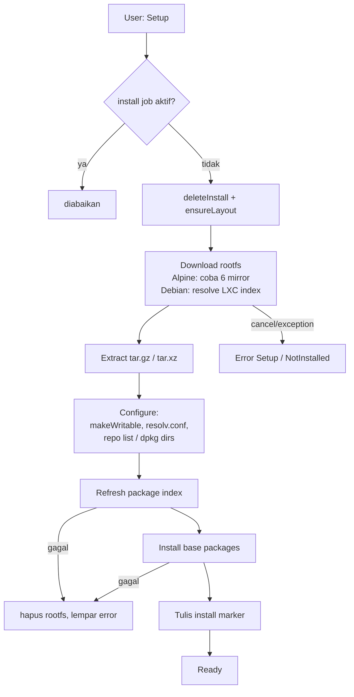
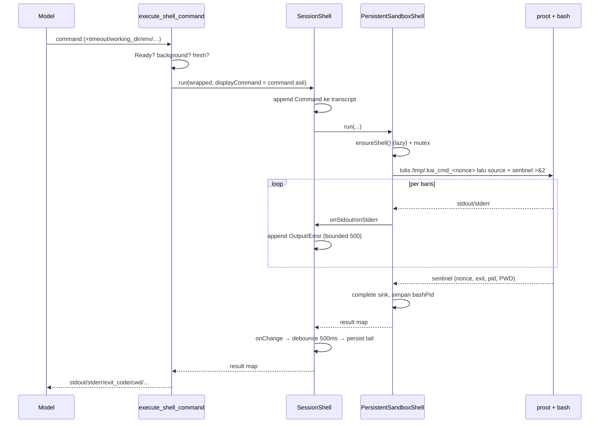
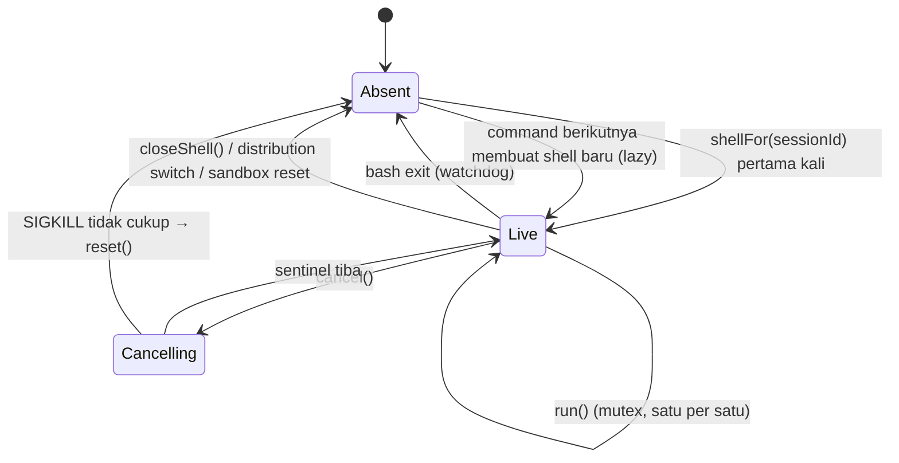

# Feature: Linux Sandbox

> **Placement note.** This is a *transfer dossier*: it documents the Linux sandbox at implementation
> level so another coding agent can re-implement the feature in a different project without reading
> Kai's source. The product/behaviour spec for the same feature lives in
> [`../sandbox.md`](../sandbox.md) — that file remains the reference for user-visible behaviour.
> This dossier is the companion for *how it works and what must be preserved*; where the two overlap,
> `../sandbox.md` is the friendlier read and this one is the authoritative one for internals.
>
> Cross-links: [`architecture.md`](architecture.md) · [`behavior.md`](behavior.md) ·
> [`implementation.md`](implementation.md)

## Status

- Status: **implemented** (shipping; Android-only)
- Project: **Kai / Kai 9000** — Kotlin Multiplatform + Compose Multiplatform (Android, iOS, desktop, wasm)
- Last verified: **2026-09-22**
- Verification level: **source inspection only.** No device/APK run, no instrumented test run was
  performed while writing this dossier. Every claim is labelled below.

### Claim labels used in this dossier

| Label | Meaning |
| --- | --- |
| **VERIFIED** | Read directly out of the source in this repository (file/line level). |
| **INFERRED** | A logical conclusion from the code that was not itself observed running. |
| **UNKNOWN** | Not established by the audit. Never to be treated as fact. |
| **PROJECT-SPECIFIC** | True of Kai only; a target project may legitimately do it differently. |

Nothing in this dossier is asserted from runtime observation. Where the existing `../sandbox.md`
already states a behaviour that this audit did not re-derive, it is attributed as
`PROJECT-SPECIFIC (per ../sandbox.md)` rather than restated as verified.

## 1. Ringkasan

Kai needs to run *real* programs — compilers, package managers, scripts the agent writes — on a
phone, without root and without a server. The Linux sandbox is a self-contained Linux user space
that makes this possible: a rootfs (Alpine or Debian) is downloaded into the app's private storage
and executed under `proot`, a user-space `chroot`/`ptrace` shim, so no kernel privilege is required.

**Problem it solves**

- An AI assistant that can only talk is far less useful than one that can *do*: install a package,
  run a build, fetch a URL, drive `ssh`/`sftp` against a server, write a file the user can open.
- Android refuses `exec` from most storage areas and denies root; a naive "just run a shell" approach
  fails on both counts.
- The user also wants to *see and steer* that machine: an interactive Terminal, a file browser, and a
  package manager, all pointed at the same filesystem the agent is using.

**What exists once the feature is present (VERIFIED)**

- A distributable selection (**Debian 12** default, or **Alpine Linux**), each installed into its own
  directory, each independently installable/uninstallable.
- A **persistent bash per logical session** — one per chat conversation, one for the in-app Terminal,
  one for system maintenance — with `cd`/`export`-style state carrying across tool calls within a
  session and *not* across sessions.
- A **shell tool** the model can call (`execute_shell_command`), plus a **background-process tool**
  (`manage_process`) and an **SSH host-configurator tool** (`ssh_configure_host`), all advertised to
  the model only once the sandbox is installed *and* switched on.
- **Interactive surfaces**: Terminal (run/cancel/stdin), Files (browse, edit, rename, delete, import
  from the phone, hand to another app), Packages (search/install/uninstall/upgrade).
- **Home migration**: when the user switches distribution, the files in the other install's `/root`
  can be merge-copied across, non-destructively.
- **No-op on every other platform**: iOS, desktop and wasm get a `NoOpSandboxController`; the tools
  are simply never registered there.

## 2. Tujuan

1. **Give the agent a real machine, safely.** Full user-space Linux, no root, no system binaries, no
   host escape beyond the app's own storage and the network the app already has permission to use.
2. **Make it feel like a terminal.** State (`cwd`, exports) persists across calls so the model (and
   the user) doesn't have to chain `cd dir && cmd` everywhere.
3. **Keep the user in control.** Nothing installs itself: a distribution is chosen and installed from
   Settings, optional packages are a separate deliberate tap, and the whole feature has an on/off
   switch that is also the model's tool gate.
4. **Make switching non-destructive.** Two distributions may coexist; choosing the other one is a
   pointer change, never a download or a delete.
5. **Stay honest about limits.** No PTY, no `link()`, no system-wide `/proc` — the feature is built
   around what Android permits instead of pretending otherwise (see
   [`behavior.md`](behavior.md#21-known-limitations)).

## 3. Perilaku Fitur

### 3.1 Install (happy path) — VERIFIED

1. User opens Settings → Tools → Linux Sandbox. The card shows the selected distribution and, if the
   sandbox is not installed, a setup action.
2. `setup()` is called. It refuses to start if an install job is already active.
3. The installer wipes any partial install, **downloads** the rootfs archive (progress is reported as
   a `0f..1f` fraction), **extracts** it, applies **per-distribution post-extraction configuration**,
   refreshes the package index, and installs the **base packages**. The archive is deleted afterwards.
4. Only when base packages succeeded does the installer write the **install marker**. From then on
   the sandbox reports **Ready**.
5. The Settings card additionally offers **Install Packages** (the optional bundle) because those are
   deliberately *not* installed by setup.
6. The model's three sandbox tools become available (given the sandbox toggle is on).

### 3.2 Install failure — VERIFIED

- Any exception during the download/extract/config phase propagates to the manager, which re-reads
  the marker off disk and publishes a `Failure.Setup` state carrying the exception message.
- An exception during package-index refresh or base-package install additionally **deletes the
  extracted rootfs** before rethrowing, so a retry cannot "succeed" by skipping the download and then
  failing the same way forever.
- Cancellation restores whatever state is actually on disk (typically `NotInstalled`).
- Partial installs never present as ready: the marker is written last, and `Ready` additionally
  requires the `proot` binary to exist and be executable.

### 3.3 Running a command (agent path) — VERIFIED

1. The model emits `execute_shell_command` with `command` (required) and optional `timeout`,
   `working_dir`, `env`, `background`, `fresh`.
2. The tool checks the sandbox is `Ready`; if not it returns an error map (no exception).
3. The session id is the **current conversation id**, falling back to a shared default session when
   the tool is invoked outside a conversation context.
4. `working_dir` and `env` are folded into a shell **prefix** (`cd '<dir>' && 'K'='V' ...`) so they do
   not pollute the persistent session; `cd` is deliberately left persistent, `env` deliberately is not.
   The *displayed* command stays the model's original one, so the Terminal shows intent, not plumbing.
5. The command runs in that session's persistent bash. Output is streamed line by line into the
   session transcript *and* accumulated into a result map.
6. The tool returns `{success, stdout, stderr, exit_code, timed_out, cwd, shell_died}`, each stream
   truncated to 15 000 characters.
7. `background: true` short-circuits to a detached one-shot process and returns a `session_id`
   instead; `fresh: true` runs in a one-shot shell whose state is discarded.

### 3.4 Running a command (human path) — VERIFIED

The Terminal UI streams instead of returning a map: the same session shell runs the line, output
lands in the shared transcript, and a `CommandHandle` lets the user cancel, or type a line that is
forwarded to the foreground command's stdin (which is how an interactive `sshpass`/`sftp` prompt is
answered).

### 3.5 Distribution switching — VERIFIED

1. `selectDistro(other)` is ignored while an install runs, and ignored if it is already selected.
2. Live shells are detached **synchronously** (so a command arriving right after the switch builds
   its shell against the new install), the selection and the storage paths are re-pointed, the install
   state is re-read, and the stale shells are reset asynchronously.
3. Nothing is downloaded or deleted. The outgoing distribution keeps its directory, its `/root`, its
   SSH keys and its packages, and switching back is instant.
4. If the target has no install, the card offers to install it — the previous one still exists.

### 3.6 File migration between installs — VERIFIED

- A survey walks the *other* install's home and answers "what does the selected one not have?"
  (count + bytes). Nothing to copy → no offer. The survey walks a whole home, so it runs off the
  calling thread and is skipped while an install is in progress.
- `migrateHome()` merge-copies: **destination always wins**, the source is never modified, so running
  it twice is safe and its own disappearance is the success signal.
- Progress is reported as `done/total`, patched at most every 25 files.

### 3.7 Cancellation of a running command — VERIFIED

Cancel escalates `SIGINT` → `SIGTERM` → `SIGKILL` against **the children of the persistent bash**,
delivered from a sibling `proot` process, waiting 500 ms between steps and stopping as soon as the
in-flight command's sentinel arrives. If even `SIGKILL` doesn't free the foreground, the whole shell
is reset; the next command lazily starts a fresh bash. If the bash pid is not known yet (cancel
arrives before the startup probe), the shell is reset immediately.

### 3.8 Self-healing — VERIFIED

The shell can die (user types `exit`, bash crashes, framing desyncs, a timeout reset). A watchdog on
the process's exit completes any in-flight command with `shell_died = true` and clears the handle, so
callers are never left waiting on a sentinel that will never arrive. The next command builds a new
shell.

### 3.9 Transcript persistence — VERIFIED

- Each session's live transcript is an observable list capped at **500 lines**, appended to and
  trimmed inside a single snapshot so a Compose measure pass can never observe a torn list.
- Trimming pauses while the user drag-selects the terminal (otherwise a pruned selectable crashes
  Compose's selection manager) and runs a catch-up trim when the gesture ends.
- Only chat-bound session ids are persisted; the Terminal and system sessions are not.
- Persistence is **debounced by 500 ms** and writes through `ConversationStorage`, which trims from the
  head to a **10 000-character** budget per conversation, and is a no-op for a conversation that has
  not been saved yet.

### 3.10 Reading and writing files — VERIFIED

Every file operation goes through a guest-path map that follows the same binds `proot` is started
with, so what the Files tab shows is what a shell in that environment sees. Traversal (`..`, relative
paths, anything canonicalising outside its root) is rejected, and the bind roots themselves can never
be renamed or deleted.

## 4. Trigger

| Trigger | What it starts | VERIFIED |
| --- | --- | --- |
| Settings → Tools → Linux Sandbox → setup | Install (download → extract → configure → base packages) | VERIFIED |
| Settings → Linux Sandbox → Install Packages | Optional package bundle, serialized on the shared package lock | VERIFIED |
| Settings → Linux Sandbox → distribution picker | `selectDistro` (pointer change, shells dropped) | VERIFIED |
| Settings → Linux Sandbox → Copy Files | `migrateHome` (merge copy of the other install's home) | VERIFIED |
| Settings → Linux Sandbox → Uninstall | `reset` (wipes the *selected* install's directory) | VERIFIED |
| Model tool call `execute_shell_command` | Persistent / one-shot / background command | VERIFIED |
| Model tool call `manage_process` | list / log / kill / remove of background jobs | VERIFIED |
| Model tool call `ssh_configure_host` | Upsert of `~/.ssh/config` host block, optional `known_hosts` line | VERIFIED |
| Terminal tab: Enter, Cancel, typed stdin line | Streaming command, cancel escalation, stdin forwarding | VERIFIED |
| Files tab becoming visible / returning to foreground | Silent re-list of the current directory; re-read of the open file if the buffer is clean | VERIFIED |
| Files tab: import action | Copy a device file into the shown directory | VERIFIED |
| Conversation deletion | Drops that conversation's shell session | VERIFIED |
| App process start | Reads the install marker to decide Ready vs NotInstalled | VERIFIED |
| Kai Build installs/removes the shared Debian | `refreshInstallState()` re-reads the marker | VERIFIED |
| Tapping a `file:`/absolute-path link in chat | Opens through the sandbox file browser instead of the platform URL handler | VERIFIED |

## 5. Input

| Input | Tipe | Wajib | Keterangan |
| --- | --- | --- | --- |
| `command` | string | ya | Shell command. Untuk jalur agent ini satu-satunya argumen wajib. |
| `timeout` | integer (detik) | tidak | Default 30, dijepit ke `1..60` oleh shell tool. |
| `working_dir` | string | tidak | Diterjemahkan menjadi `cd '<dir>' &&` di depan command; persist untuk panggilan berikutnya. |
| `env` | object string→string | tidak | Diterjemahkan menjadi prefix `'K'='V'`; hanya berlaku untuk panggilan itu. |
| `background` | boolean | tidak | `true` → proses one-shot terlepas, mengembalikan `session_id`. |
| `fresh` | boolean | tidak | `true` → shell one-shot terisolasi, state dibuang saat keluar. |
| `sessionId` | string (internal) | tidak | Id sesi shell; default `SandboxSessions.DEFAULT` di level controller. |
| `distro` | enum `LinuxDistro` | tidak | Pilihan distribusi (Debian/Alpine). |
| `alias`, `hostname`, `user`, `port`, `identity_file`, `known_host_line` | string/int | ya (alias+hostname) / tidak (sisanya) | Argumen tool `ssh_configure_host`. |
| `path`, `content`, `newName`, `recursive`, `force`, `source` (PlatformFile) | string/bool/PlatformFile | sesuai operasi | Input layer file browser (list/read/write/rename/delete/import). |

Catatan: tidak ada kredensial yang dibutuhkan fitur ini. Sandbox tidak memiliki API key, token, atau
secret sendiri — ia berjalan sepenuhnya lokal di perangkat.

## 6. Output

| Output | Bentuk | Keterangan |
| --- | --- | --- |
| Status sandbox | `StateFlow<SandboxStatus>` | `installed`, `ready`, `working`, `progress`, `label` (step terjemahan), `diskUsageMB`, `packagesInstalled`, `error`, `distro`, `installedDistros`, `migration`. |
| Hasil command (agent) | `Map<String, Any>` | `success`, `stdout`, `stderr`, `exit_code`, `timed_out`, `cwd`, `shell_died`. |
| Hasil command (controller) | `String` | Gabungan stdout+stderr+error, atau `Exit code: N` bila kosong; `"Sandbox is not ready"` bila belum siap. |
| Streaming | `CommandHandle` + callback `onStdout`/`onStderr` | `cancel()`, `isCancelled()`, `writeInput(line)`, `awaitExit()`. |
| Transkrip | `SnapshotStateList<TerminalLine>` | `Command`/`Output`/`Error`, live per sesi, max 500 baris. |
| Persistensi | tulisan ke conversation | Tail transkrip (≤10 000 karakter) untuk sesi yang terikat percakapan. |
| Perubahan filesystem | rootfs + `homeDir` + `projectsDir` + `tmpDir` | Rootfs di app-internal storage; `projects` dan `/tmp` dari bind. |
| Perubahan state | `SandboxState` | `NotInstalled` / `Downloading` / `Extracting` / `Installing(label)` / `Ready` / `Error(label)`. |
| Network | unduhan rootfs + index paket | Mirror Alpine (6 kandidat) atau LXC image index untuk Debian. |
| Tool result | `Map` / `String` | Ke model, sebagai hasil tool. |
| UI events | status label terjemahan | Dari `SandboxStatusLabel` → string resource, hanya di layer UI. |

## 7. Alur Kerja

### 7.1 Instalasi

Penjelasan tiap tahap:

1. **Guard**: hanya satu job instalasi pada satu waktu (`currentJob?.isActive`).
2. **Wipe + layout**: instalasi parsial/sebelumnya dihapus supaya retry selalu ekstrak bersih;
   `ensureLayout()` dipanggil ulang karena `deleteInstall()` ikut menghapus `tmp` yang di-bind sebagai `/tmp`.
3. **Download**: satu path unduhan dengan fallback mirror; arsip dihapus di `finally`.
4. **Extract**: satu pembaca tar untuk `.tar.gz` dan `.tar.xz`.
5. **Configure**: perbaikan pasca-ekstraksi yang harus ada sebelum `proot` pertama (izin tulis,
   `resolv.conf`, direktori yang `apt`/`dpkg` asumsikan ada, `force-unsafe-io` untuk Debian).
6. **Package index**: Debian satu index; Alpine menulis ulang `repositories` per mirror sampai ada
   yang menjawab.
7. **Base packages**: Alpine satu paket per panggilan (progres per paket); Debian seluruh set dalam
   satu panggilan (dependency solver melihat gambaran penuh).
8. **Marker**: ditulis terakhir — inilah yang membuat state parsial tidak pernah tampak siap.

### 7.2 Eksekusi command

### 7.3 Siklus hidup sesi shell

## 8. Komponen yang Terlibat

| Komponen | Peran | Project Reference |
| --- | --- | --- |
| Sandbox contract | Antarmuka lintas platform: status, sesi, eksekusi, transkrip, operasi file | `composeApp/src/commonMain/kotlin/com/inspiredandroid/kai/SandboxController.kt` |
| No-op implementation | Yang dipakai iOS/desktop-mayoritas/wasm | `SandboxController.kt` (`NoOpSandboxController`), `createSandboxController()` per target |
| Android controller | Menjembatani state manager ke `SandboxStatus`, menjalankan command & file ops | `composeApp/src/androidMain/kotlin/com/inspiredandroid/kai/SandboxController.android.kt` |
| Sandbox manager | Marker, lifecycle sesi, instalasi opsional, migrasi, pemilihan distro, disk usage | `composeApp/src/androidMain/kotlin/com/inspiredandroid/kai/sandbox/LinuxSandboxManager.kt` |
| Sandbox state | Enum state internal sebelum dipetakan ke status publik | `.../sandbox/SandboxState.kt` |
| DI module | Registrasi manager | `.../sandbox/SandboxModule.kt` |
| Persistent shell | bash jangka panjang, framing sentinel, cancel bergradasi, self-healing | `.../sandbox/PersistentSandboxShell.kt` |
| Session facade | Transkrip per sesi + bound + persist callback | `.../sandbox/SessionShell.kt` |
| Proot executor | Tampilan line-oriented rootfs; hasil berupa map | `.../sandbox/ProotExecutor.kt` |
| Proot launcher | argv, binds, env, `ProotHandle`, eksekusi one-shot | `.../linux/ProotLauncher.kt` |
| Installer | Download → extract → configure → base packages, cancellable | `.../linux/LinuxInstaller.kt` |
| Install registry | Direktori mana yang menjadi rumah distribusi mana | `.../linux/LinuxInstalls.kt` |
| Storage layout | rootfs, tmp, projects bind, proot/libtalloc, install marker (termasuk adopsi layout legacy) | `.../linux/LinuxPaths.kt` |
| Distro facts | Nama arsitektur, URL rootfs, perbaikan pasca-ekstraksi, flag/env proot | `.../linux/DistroSpec.kt` |
| Download + extract | Satu jalur unduhan dengan mirror fallback; satu pembaca tar | `.../linux/RootfsDownloader.kt`, `.../linux/TarExtractor.kt` |
| Distro model | Dua distribusi + set paket base/optional/protected | `composeApp/src/commonMain/kotlin/com/inspiredandroid/kai/linux/LinuxDistro.kt` |
| Package manager specs | Command + parser per `apk`/`apt`, murni & unit-tested | `.../linux/PackageManagerSpec.kt`, `ApkPackageManager.kt`, `AptPackageManager.kt` |
| Home migration | Survey + merge-copy satu home ke home lain | `composeApp/src/jvmShared/kotlin/com/inspiredandroid/kai/linux/HomeMigration.kt` |
| Guest path map | path guest → file host, mengikuti binds, menolak traversal | `composeApp/src/jvmShared/kotlin/com/inspiredandroid/kai/linux/GuestPath.kt` |
| SSH config writer | Blok `~/.ssh/config` (defaults + per-host) yang idempoten, mode file dikunci | `composeApp/src/jvmShared/kotlin/com/inspiredandroid/kai/sandbox/SshConfigManager.kt` |
| Shell tool | Tool `execute_shell_command` + deskripsi per distro | `composeApp/src/androidMain/kotlin/com/inspiredandroid/kai/tools/ShellCommandTool.kt` |
| SSH tool | Tool `ssh_configure_host` | `.../tools/SshConfigureHostTool.kt` |
| Process manager | Tabel sesi background + start/list/log/kill/remove | `.../tools/ProcessManager.kt` |
| Process tool | Tool `manage_process` (dibagi Android & desktop) | `composeApp/src/jvmShared/kotlin/com/inspiredandroid/kai/tools/ProcessManagerTool.kt` |
| Tool gating | Sandbox tools hanya didaftarkan saat enabled **dan** Ready | `composeApp/src/androidMain/kotlin/com/inspiredandroid/kai/Platform.android.kt` |
| File operations | list/read/write/rename/delete/import + klasifikasi teks vs biner | `.../sandbox/SandboxFiles.kt`, `composeApp/src/commonMain/kotlin/com/inspiredandroid/kai/FileBrowserSource.kt` |
| Terminal ViewModel | Buffer, run/cancel, tab sesi | `composeApp/src/commonMain/kotlin/com/inspiredandroid/kai/ui/sandbox/SandboxSessionViewModel.kt` |
| Terminal UI | Tampilan terminal + input interaktif | `composeApp/src/commonMain/kotlin/com/inspiredandroid/kai/ui/settings/TerminalSheet.kt` |
| Files UI | Browser + editor teks, refresh-on-visible | `.../ui/sandbox/SandboxFileBrowserViewModel.kt`, `SandboxFileBrowserScreen.kt` |
| Packages UI | Cari/install/uninstall/upgrade via spec distro | `.../ui/sandbox/SandboxPackagesViewModel.kt`, `SandboxPackagesScreen.kt` |
| Tabs content | Kerangka sub-tab Terminal/Files/Packages | `.../ui/sandbox/SandboxTabsContent.kt` |
| Status text | `SandboxStatusLabel` → kalimat terjemahan | `.../ui/sandbox/SandboxStatusText.kt` |
| Settings card | Distribusi, setup, packages, migrasi, uninstall | `.../ui/settings/SandboxSettings.kt`, `SandboxViewModel.kt` |
| Transcript persistence | `updateShellTranscript` + trim budget | `composeApp/src/commonMain/kotlin/com/inspiredandroid/kai/data/ConversationStorage.kt` |
| Session teardown | Menutup shell saat percakapan dihapus | `.../data/RemoteDataRepository.kt` (`deleteConversation`) |
| URI handler | `file:`/absolute link → `openFile` | `.../ui/SandboxUriHandler.kt` |
| Native payload | `proot`, `libproot-loader`, `libtalloc` per ABI | `androidApp/src/main/jniLibs/<abi>/`, dibangun oleh `build-proot.sh` |
| FileProvider paths | Area yang boleh diserahkan ke app lain | `androidApp/src/main/res/xml/file_paths.xml` |
| Kai Build side | PTY executor + konsumen rootfs Debian yang sama | `composeApp/src/androidMain/kotlin/com/inspiredandroid/kai/build/runtime/BuildProotExecutor.kt` |

Baca lanjut: [`architecture.md`](architecture.md) untuk arsitektur, data/state, dependency dan
konfigurasi; [`behavior.md`](behavior.md) untuk error handling, edge case, lifecycle dan limitasi;
[`implementation.md`](implementation.md) untuk kontrak fitur, acceptance criteria dan panduan migrasi.
