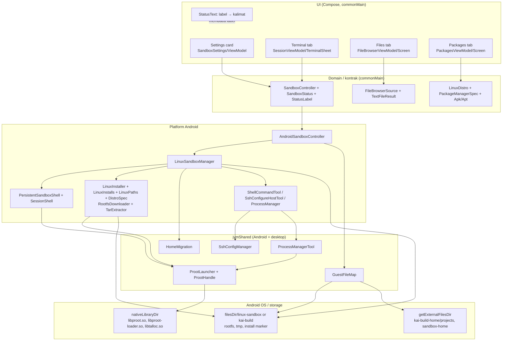

# Linux Sandbox — Arsitektur, Data & Konfigurasi

Bagian dari dossier [Linux Sandbox](README.md). Isi: §9 Arsitektur · §10 Data dan State ·
§11 Dependencies · §12 Configuration.

## 9. Arsitektur

### 9.1 Lapisan



**UI** tidak tahu apa-apa soal `proot`. **Domain** (commonMain) adalah kontrak yang dipakai semua
platform; `expect fun createSandboxController()` memilih implementasi. **Android** memegang seluruh
mesin. **jvmShared** memegang potongan murni `java.io`/JVM yang bisa diuji tanpa perangkat
(`HomeMigration`, `GuestFileMap`, `SshConfigManager`) dan tool `manage_process` bersama.

### 9.2 Batas penting

- **UI ↔ domain**: hanya lewat `SandboxStatus` + `SandboxController`. Status adalah data immutable;
  install berjalan di luar komposisi dan melaporkan *step* sebagai nilai
  (`SandboxStatusLabel`), bukan kalimat. Satu-satunya tempat kata-kata hidup adalah
  `SandboxStatusText`. → **PROJECT-SPECIFIC** (pilihan lokalisasi Kai), tapi kontraknya penting:
  *platform melaporkan langkah, UI yang memberi nama.*
- **Domain ↔ Android**: `SandboxStatus` hanya berisi tipe commonMain (`LinuxDistro` ikut pindah ke
  commonMain justru agar ini mungkin).
- **Android ↔ proses guest**: hanya lewat `ProotLauncher`/`ProotHandle`. Tidak ada tempat lain yang
  menyusun argv `proot`.
- **Host ↔ guest**: dua arah yang berbeda — eksekusi (`proot`) dan pembacaan file host
  (`GuestFileMap`). Keduanya harus memakai bind yang **sama**; itulah alasan `createLauncher()` dan
  `fileMap()` berada berdampingan di manager, dengan komentar eksplisit bahwa keduanya harus cocok.

### 9.3 Aliran eksekusi (dua executor, satu launcher)

Dua cara membaca keluaran `proot` berbagi satu jalur start:

| Jalur | Bentuk keluaran | Dipakai oleh |
| --- | --- | --- |
| `ProotExecutor.execute` | String lengkap, di-`CompletableFuture` pada stdout **dan** stderr secara paralel, dengan timeout `1..180` detik | Base/optional package install, `fresh: true`, background job, perintah `ssh` config seed, sinyal cancel |
| `ProotExecutor.executeStreaming` | Baris demi baris lewat dua thread pembaca, tanpa timeout implisit | Persistent bash (satu proses panjang) dan Terminal UI |

Membaca stdout lalu stderr secara berurutan akan **deadlock** begitu buffer pipa lain penuh; karena
itu kedua stream selalu dikuras bersamaan.

### 9.4 Framing keluaran persistent shell (mekanisme inti)

Tidak ada PTY, jadi shell tidak bisa memberi tahu "perintah selesai". Solusinya adalah *sentinel*:

- Secret nonce 16 karakter hex dibuat per perintah.
- Perintah ditulis ke `/tmp/.kai_cmd_<nonce>` (di dalam guest), lalu shell menjalankan
  `. /tmp/.kai_cmd_<nonce>; __kai_st=$?; rm -f /tmp/.kai_cmd_<nonce>; printf '\n\036<nonce>\037<exit>\037<pid>\037<PWD>\036\n' >&2`.
- Karena perintah di-*source* (bukan dijalankan sebagai child), `cd`/`export`/`.script` mempengaruhi
  shell itu sendiri → **state persist**.
- Sentinel dikirim ke **stderr**, sehingga `2>/dev/null` yang dilakukan program user tidak bisa
  menelannya. Karakter `\036` (RS) dan `\037` (US) dipilih karena praktis tidak muncul di output nyata;
  `\n` di depan sentinel mem-flush baris parsial (mis. prompt `>>>` Python tanpa newline).
- Satu probe pid dijalankan sekali saat shell lahir (`\036KAIBASHPID\037<pid>\036`) supaya **cancel pada
  perintah pertama** sudah punya target — tanpa ini `bashPid` baru terisi setelah perintah pertama selesai.
- Baris stderr kosong dibuang (sentinel menghasilkan satu baris kosong "flush" yang tidak berarti).

Dispatch stderr memeriksa tiga hal berurutan: probe pid → pola sentinel (`parts.size == 4` dan
nonce cocok) → baris stderr biasa.

### 9.5 Isolasi state per sesi

| Id sesi | Siapa yang memakai | Transkrip dipersist? |
| --- | --- | --- |
| id percakapan (uuid) | Tool `execute_shell_command` dalam chat | ya |
| `__terminal__` | Terminal tab scratch | tidak |
| `__system__` | Operasi maintenance (mis. Packages tab) | tidak |
| `__default__` | Fallback bila tidak ada konteks percakapan | tidak |

Rootfs dan `/root` **dibagi** di antara semua sesi (satu filesystem); yang per-sesi hanyalah state
hidup: `cwd`, environment yang di-`export`, job `&`, dan koneksi `ssh-agent`.

### 9.6 Prinsip isolasi host

Sandbox **bukan** container keamanan: `proot` tidak memberi isolasi kernel (tidak ada namespace yang
dipaksakan). Yang membatasinya adalah fakta Android:

- Rootfs berada di app-internal storage milik uid aplikasi.
- `proot` berjalan sebagai uid aplikasi, tanpa root (`-0` hanya *berpura-pura* menjadi root di dalam guest).
- Yang di-bind masuk hanya `/dev`, `/proc`, `/sys`, `tmpDir → /tmp`, dan (bila ada) `homeDir → /root`,
  `projectsDir → /root/projects`.
- Ia tidak bisa lebih kuat daripada izin yang sudah dimiliki app; kemampuannya (jaringan, storage,
  eksekusi) berhenti di batas yang Android sudah berikan.

**Konsekuensi desain (VERIFIED dari kode):** solver masalahnya selalu "apa yang Android larang", bukan
"apa yang kernel larang" — lihat `link()`/ControlMaster, `protected_hardlinks` untuk dpkg, dan
`hidepid=2` di [`behavior.md`](behavior.md#21-known-limitations).

## 10. Data dan State

### 10.1 State di memori

```text
SandboxState (internal, Android)
   NotInstalled ──setup()──▶ Downloading(fraction) ─▶ Extracting
        │                                              │
        │                                              ▼
        │                              Installing(label: Configuring/BasePackages/InstallingPackage)
        │                                              │
        │◀── reset()/cancel() ─────────────────────────┤
        │                                              ▼
        └──────────────── Error(Failure.*) ◀─────── Ready
                                                       ▲
                       migrateHome() → Installing(CopyingFiles(done,total)) ─┘
```

`SandboxState` → `SandboxStatus` (publik) dipetakan di `AndroidSandboxController.mapState`:

| `SandboxState` | `SandboxStatus` |
| --- | --- |
| `NotInstalled` | `label = NotInstalled` |
| `Downloading(f)` | `working=true, progress=f, label=Downloading` |
| `Extracting` | `working=true, label=Extracting` |
| `Installing(label)` | `installed = rootfsDir.isDirectory, working=true, label` |
| `Ready` | `installed=ready=true, label=Ready, diskUsageMB (cache), packagesInstalled` |
| `Error(label)` | `error=true, label` |

Tiga nilai "turunan mahal" **di-cache** dengan alasan eksplisit di kode (VERIFIED):

- `diskUsageMB` — walk seluruh rootfs. Dihitung hanya saat transisi masuk `Ready`; `quickStatus()`
  (dipakai saat start proses dan saat pindah distribusi) sengaja **tidak** menghitungnya, dan
  seederan awal sinkron tidak menghitungnya agar tidak memblokir thread pemanggil (sering main thread,
  karena Koin di-resolve malas dari Composable).
- `installedDistros` — membaca dua marker. Hanya di-refresh ketika **tidak** sedang bekerja; jadi
  update progres unduhan per potongan tidak membaca ulang disk.
- `migration` — walk home distribusi lain. Dihitung di IO, di-skip selama install berjalan, dan
  hasilnya **dibuang** bila distribusi berubah saat walk berjalan (jawaban itu menggambarkan install
  yang sudah ditinggalkan — tidak boleh dipublikasikan maupun disimpan).

### 10.2 State di disk

```
filesDir/linux-sandbox/          ← rumah utama; default untuk Alpine
├── install                      ← MARKER: "distro=<id>\nhome=rootfs|external\n"
├── rootfs/                      ← hasil ekstraksi; /root ada DI DALAM sini (homeOnRootfs=true)
│   └── root/projects/           ← mount point (kosong) yang di-bind
├── tmp/                         ← di-bind menjadi /tmp (PROOT_TMP_DIR juga menunjuk ke sini)
├── libtalloc.so.2               ← salinan bernama benar (Android membuang suffix .so.2)
└── rootfs.tar.gz | .tar.xz      ← hanya selama instalasi (dihapus di finally)

filesDir/kai-build/              ← rumah cadangan; default untuk Debian (Kai Build)
    └── (struktur sama)

getExternalFilesDir(null)/
├── kai-build-home/projects/     ← di-bind ke /root/projects (dibagi kedua install Debian)
└── sandbox-home/                ← hanya untuk install lama (homeOnRootfs=false)
```

**Install marker** (`install`) adalah satu-satunya sumber kebenaran "apa yang terpasang":
`distro=<id>`, `home=<rootfs|external>`. `readMarker()` mengembalikan `null` bila `rootfs/` bukan
direktori, sehingga instalasi setengah jalan tidak pernah terbaca sebagai selesai.

**Adopsi legacy** (VERIFIED): bila marker tidak ada tetapi file bukti ada, marker legacy dituliskan ke
disk dan dipakai:
- direktori sandbox: bukti = `rootfs/etc/alpine-release` → marker Alpine, `homeOnRootfs=false`
  (hanya Alpine yang punya file ini, jadi ia membedakan "install lama yang selesai" dari "Debian yang
  masih diekstrak" — direktori rootfs saja tidak cukup sebagai bukti).
- direktori build: bukti = file `ready` → marker Debian, `homeOnRootfs=true`.

**`homeOnRootfs`** menentukan di mana `/root` sebenarnya berada, dan itu mengubah binds:
`true` → `/root` bagian dari rootfs (tidak ada bind, file browser membaca dari rootfs);
`false` → `/root` di-bind dari `sandbox-home/` di external storage, dan file browser harus
menambal listing `/` agar `root` muncul (mount point-nya kosong di dalam rootfs).

Alasan `homeOnRootfs=true` untuk install baru (VERIFIED dari komentar + kode): hanya
`nativeLibraryDir`/app-internal yang diizinkan Android untuk `exec`, sehingga agen coding yang
dipasang di `~/.local/bin` benar-benar bisa dijalankan.

### 10.3 Data yang dibagi dengan Kai Build

- **Satu direktori per distribusi**, bukan per fitur. `LinuxInstalls.pathsFor(distro)`:
  Debian memilih `kai-build/` dulu lalu `linux-sandbox/`; Alpine sebaliknya. Kandidat pertama yang
  markernya **milik distro itu** dipilih; kalau tidak ada, direktori pertama yang **tanpa marker**;
  kalau tidak ada juga, kandidat pertama. Direktori milik distribusi lain **tidak pernah** dikembalikan
  (itu akan menghapus install yang masih bisa dipakai user).
- Implikasinya: chat sandbox yang dipilih ke Debian dan Kai Build **menunjuk direktori yang sama**
  → satu unduhan, satu rootfs, satu uninstall. Project folder (`/root/projects`) hidup di external
  storage dan selamat dari uninstall.
- **Lock paket proses-wide** (`LinuxInstaller.packageLock`) menjaga agar "Install Packages" dan
  instalasi agen Kai Build tidak menabrak lock `dpkg` bersamaan. Aplikasi lock ini dilakukan oleh
  pemanggil (manager memegangnya selama loop paket opsional).

### 10.4 Persistensi transkrip

`TerminalLine` = `Command` / `Output` / `Error` (serializable). Alurnya:

```text
PersistentSandboxShell output
   → SessionShell.appendBounded (snapshot tunggal; cap 500 baris; prune bisa dijeda)
   → SessionShell.onChange(list)          [hanya untuk sesi persistable]
   → LinuxSandboxManager.scheduleTranscriptSave (debounce 500 ms, per sesi)
   → ConversationStorage.updateShellTranscript(id, lines)
   → trim dari kepala sampai ≤ 10 000 karakter
   → ConversationPersistence.saveShellTranscript (SQLDelight)
```

Saat shell dibuat untuk sesi persistable, transkrip yang tersimpan di percakapan itu dipakai sebagai
`initialLines`, jadi membuka kembali chat lama setelah restart masih memperlihatkan ekor aktivitas —
walaupun shell **hidup** tidak ikut kembali.

### 10.5 Lifecycle data

| Data | Dibuat | Diubah | Dihapus |
| --- | --- | --- | --- |
| Rootfs + marker | `LinuxInstaller.install` | `writeMarker` (legacy adoption) | `reset()` (`paths.root.deleteRecursively()`), `deleteInstall()` saat retry |
| `libtalloc.so.2` | `copyLibtalloc()` (idempoten) | — | ikut `reset()` |
| Home (`/root`) | ekstraksi rootfs / mkdir | agent + user | ikut `reset()` (kecuali layout legacy, yang berada di luar `root`) |
| `projects` / `tmp` bind | `ensureLayout`/`ensureMountPoints` | agent + user | **`root`** miliknya sendiri; `projects` selamat dari uninstall |
| Transkrip tersimpan | `updateShellTranscript` | tiap save berikutnya | `deleteConversation` |
| Sesi shell hidup | `shellFor` | `run` | `closeShell`, switch distro, `reset`, kematian bash |
| Tabel job background | `startBackground` | hasil job | `remove` (in-memory saja; hilang saat proses app mati) |

## 11. Dependencies

### Internal (wajib)

- Kontrak `SandboxController` / `SandboxStatus` / `SandboxStatusLabel` / `SandboxSessions` /
  `CommandHandle` / `SandboxFileEntry` / `FileBrowserSource`.
- Model distribusi bersama: `LinuxDistro` + `PackageManagerSpec` (+ `ApkPackageManager`,
  `AptPackageManager`) di commonMain — sengaja common agar UI (commonMain) bisa merender kartu tanpa
  mengetahui Android.
- `ProotLauncher`/`ProotHandle` sebagai satu-satunya jalur start proses.
- `LinuxInstalls` + `LinuxPaths` sebagai satu-satunya jawaban "di mana install ini".
- `ConversationStorage` (+ `ConversationPersistence`) untuk transkrip.
- `ConversationIdContext` / `currentConversationIdOrNull()` — elemen coroutine-context yang
  mengalirkan id percakapan sampai ke eksekusi tool tanpa mengotori `Tool.execute(args)`.
- `AppSettings` (toggle sandbox, distro terpilih) dan `linux.LinuxDistro` sebagai tipe setelan.
- Kerangka tool (`Tool`, `ToolSchema`, `ParameterSchema`, `ToolInfo`) dan registrasi tool per platform.
- `smartTruncate` untuk pemotongan output yang tidak memotong di tengah grapheme.
- `TerminalLine` (serializable) untuk transkrip.

### External (wajib)

- **`proot` + `libproot-loader` + `libtalloc`** — di-*vendor* sebagai native library per ABI dan
  dibangun oleh `build-proot.sh`; dikemas dengan `useLegacyPackaging = true` agar tersedia di
  `nativeLibraryDir` (satu-satunya tempat Android mengizinkan `exec`) dengan bit eksekusi utuh.
  Ini **wajib** untuk fitur ini: tanpa `proot` tidak ada sandbox.
- **HTTPS client** untuk mengunduh rootfs (di Kai: Ktor/OkHttp). Yang wajib hanyalah "satu klien HTTP
  dengan streaming ke file"; pilihannya bebas.
- **`FileProvider`** (androidx.core) + `file_paths.xml` untuk menyerahkan file ke aplikasi lain.
- **Android `Context`** untuk `filesDir`, `getExternalFilesDir`, `nativeLibraryDir`, `packageManager`
  (untuk memilih aplikasi pembuka).
- Package manager **di dalam guest**: `apk` (Alpine) / `apt`+`dpkg` (Debian) — sudah bagian dari rootfs.

### External (opsional)

- **Ktor OkHttp engine** — implikasi pilihan cara unduh (PROJECT-SPECIFIC).
- **Koin** — DI (PROJECT-SPECIFIC).
- **`compose.components.resources`** — lokalisasi kalimat status (PROJECT-SPECIFIC).
- **FileKit** (`PlatformFile`) — pemilih file untuk fitur import (PROJECT-SPECIFIC).
- **SQLDelight** — persistensi transkrip (PROJECT-SPECIFIC).
- **XZ** (`libs.xz`) — dibutuhkan hanya karena Debian memakai `.tar.xz` (PROJECT-SPECIFIC untuk
  Debian; kalau target memilih `.tar.gz` saja, dependensi ini hilang).
- **`sshpass`** di dalam guest — di-*install on demand* oleh agen/user, bukan bagian dari fitur.
- **`openssh-client`, `lftp`, `rsync`** — bagian paket **optional**, bukan base.

### Tidak dibutuhkan

- Root, rootfs host, `chroot`, namespace kernel, `unshare`, KVM, atau server-build. Fitur ini berjalan
  penuh di perangkat.

## 12. Configuration

### Setelan pengguna (VERIFIED)

| Kunci | Default | Efek |
| --- | --- | --- |
| `sandbox_enabled` (toggle) | `true` | Gate pendaftaran tool + visible-ness kartu. Tidak menghentikan install yang sudah jalan. |
| `sandbox_distro` | tidak ada (null) | Pilihan distribusi terakhir. `null` berarti "belum pernah memilih" → lihat resolusi di bawah. |

**Resolusi pilihan awal** (`initialSelection()`):
`appSettings.getSandboxDistroOrNull() ?: installs.distroInSandboxDir() ?: LinuxDistro.DEFAULT`.
Bagian tengahnya penting: sandbox yang dipasang sebelum pemilih ada tidak pernah mencatat pilihan, dan
default akan mengirimnya ke Debian yang belum pernah ia punya — jadi install yang **sudah ada di
direktori sandbox** dianggap sebagai pilihan user sampai user memilih lain.

### Konstanta yang membentuk perilaku (VERIFIED, di kode)

| Konstanta | Nilai | Di mana | Kenapa |
| --- | --- | --- | --- |
| Output cap | 15 000 karakter per stream | `PersistentSandboxShell`, `ProotExecutor`, `ProotLauncher` | Batas hasil tool yang aman untuk konteks model. |
| Timeout default / maks (tool shell) | 30 s / 60 s | `ShellCommandTool` | Batas per-panggilan; sesi tetap hidup di antara panggilan. |
| Timeout maks (one-shot executor) | 180 s | `ProotExecutor` | Package install butuh lebih lama. |
| Timeout index paket / paket | 300 s / 900 s | `LinuxInstaller`, `LinuxSandboxManager` | apt/apk pada ponsel lambat. |
| Timeout streaming terminal | 24 jam | `SandboxController.android` | Cancel dan exit proses adalah sinyal "selesai" yang sebenarnya. |
| Cap transkrip | 500 baris (memori), 10 000 karakter (disk) | `SessionShell`, `ConversationStorage` | Batas memori + batas tulis per percakapan. |
| Debounce simpan transkrip | 500 ms | `LinuxSandboxManager` | Ledakan output (mis. loop 1000 iterasi) tidak boleh menulis storage per perintah. |
| Langkah progres migrasi | 25 file | `LinuxSandboxManager` | Satu status per file = ribuan recomposition. |
| Grace cancel | 500 ms per sinyal, +2 s sebelum reset | `PersistentSandboxShell` | Beri kesempatan proses merespons. |
| Cap editor | 512 000 byte | `FileBrowserSource.MAX_BROWSER_TEXT_BYTES` | Buffer terpotong tidak bisa disimpan dengan aman. |
| Distro | Alpine `3.22.5` / branch `v3.22`; Debian `bookworm` | `DistroSpec` | Alpine ≥3.23 memakai apk-tools 3 (`execveat`) yang tidak didukung proot. |
| Mirror Alpine | 6 URL (CDN, kernel.org, RWTH, ETHZ, Waterloo, Tsinghua) | `DistroSpec` | `apk update` harus punya jalan keluar bila satu mirror mati. |
| Index Debian | `images.linuxcontainers.org/meta/1.0/index-user` | `DistroSpec` | Dipilih image `debian;bookworm;<arch>;default;` terbaru. |

### Flag dan environment proot (VERIFIED)

Argv (`ProotLauncher.buildArgs`):

```
<proot> <extraArgs…> --rootfs=<rootfs> --bind=/dev --bind=/proc --bind=/sys
        [--bind=<host>:<guest>…] --bind=<tmp>:/tmp -0 -w <workingDir> /bin/sh -c <command>
```

- `-0` = berpura-pura menjadi root di dalam guest (bukan eskalasi host).
- `-w` = direktori kerja awal.
- Working directory **host** proses di-set ke `parent(rootfs)`.

Environment (`buildEnv`, base + per-distro + per-panggilan):

| Variabel | Nilai | Alasan |
| --- | --- | --- |
| `HOME` | `/root` | Home guest. |
| `PATH` | `/usr/local/sbin:/usr/local/bin:/usr/sbin:/usr/bin:/sbin:/bin` | Default; pemanggil bisa menimpa. |
| `TERM` | `xterm-256color` | Warna/`ls` yang wajar. |
| `LANG` | `C.UTF-8` | Encoding teks. |
| `LD_LIBRARY_PATH` | direktori install | `proot` mencari `libtalloc.so.2` di sini. |
| `PROOT_TMP_DIR` | `<install>/tmp` | Ruang kerja proot. |
| `PROOT_LOADER` | `<dir(proot)>/libproot-loader.so` | Loader yang harus diload `proot`. |
| `DEBIAN_FRONTEND` | `noninteractive` | Hanya Debian: apt tidak boleh bertanya tanpa TTY. |

Flag khusus distribusi (`DistroSpec.prootArgs`):

- **Debian**: `--link2symlink -L`. Wajib: `dpkg` membuka paket lewat *hardlink*, dan kebijakan
  `protected_hardlinks` Android menolaknya di dalam sandbox app. Tanpa emulasi ini, instalasi base
  gagal pada subproses dpkg **meskipun** `apt-get update` sudah sukses. `-L` adalah perbaikan `lstat`
  yang menyertainya.
- **Alpine**: tidak ada flag khusus; satu-satunya penerapan adalah pada versi rootfs.

### Binds (VERIFIED)

| Host | Guest | Kapan |
| --- | --- | --- |
| `/dev` | `/dev` | selalu |
| `/proc` | `/proc` | selalu |
| `/sys` | `/sys` | selalu |
| `<install>/tmp` | `/tmp` | selalu |
| `homeDir` | `/root` | **hanya** bila `homeOnRootfs == false` (layout legacy) |
| `projectsDir` | `/root/projects` | **hanya** untuk Debian (Alpine tidak punya Kai Build → mount point akan jadi folder asing) |

### Build configuration (PROJECT-SPECIFIC)

- `androidApp/build.gradle.kts`: `packaging.jniLibs.useLegacyPackaging = true` — agar `.so` tidak
  dikompresi/di-strip dan tetap ada di `nativeLibraryDir`.
- `androidApp/src/main/jniLibs/<abi>/{libproot.so,libproot-loader.so,libproot-loader32.so,libtalloc.so}`
  untuk `arm64-v8a`, `armeabi-v7a`, `x86_64`; dibangun oleh `build-proot.sh`.
- `androidApp/src/main/AndroidManifest.xml`: deklarasi `FileProvider` (`${applicationId}.fileprovider`,
  `exported=false`, `grantUriPermissions=true`) dengan metadata `@xml/file_paths`.
- `androidApp/src/main/res/xml/file_paths.xml`: `external-path`, `files-path`, `cache-path`,
  `external-files-path sandbox-home/`, `external-files-path kai-build-home/`.
- Penyalinan `libtalloc.so` → `libtalloc.so.2` dilakukan **saat runtime** karena Android membuang
  suffix `.so.2` dari `jniLibs`.

### Yang TIDAK boleh dimasukkan sebagai konfigurasi

Tidak ada API key, token, password, atau kredensial apa pun milik fitur ini. Kunci SSH milik user
disimpan **di dalam sandbox** (`~/.ssh`) dan tidak pernah dibuat atau diunggah oleh fitur — tool
`ssh_configure_host` hanya menulis `config`/`known_hosts` dan menyatakan secara eksplisit bahwa ia
tidak membuat kunci privat.
