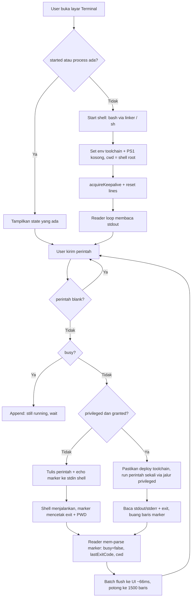

# Feature: Built-in Terminal (Interactive In-App Shell)

## Status

- Status: implemented
- Project: AndroidHarness (`com.androidharness.app`), Kotlin + Jetpack Compose, Android
- Last verified: 2026-09-22 (source inspection only, lihat bagian 23)

Label yang dipakai di dokumen ini: `VERIFIED` (dibaca langsung dari source code), `INFERRED` (kesimpulan logis dari implementasi, belum diuji runtime), `UNKNOWN` (belum ditemukan), `PROJECT-SPECIFIC` (hanya berlaku untuk project asal).

---

## 1. Ringkasan

Fitur ini adalah terminal interaktif yang dijalankan **di dalam aplikasi** (bukan aplikasi terminal terpisah dan bukan terminal emulator layar penuh dengan pty). User mengetik satu perintah, perintah dikirim ke sebuah shell hidup, output-nya ditampilkan baris per baris di layar, dan working directory (`cwd`) ikut ter-update mengikuti perpindahan direktori yang dilakukan perintah tersebut.

Masalah yang diselesaikan:

- User dan agent bekerja di file project nyata di device, dan sering perlu menjalankan perintah manual (git, build, ls, python, `gh`) di luar chat, dengan cara yang tidak memaksa user menutup aplikasi agent.
- Perintah perlu bisa dijalankan pada **dua tingkat hak akses** berbeda: sebagai user aplikasi (toolchain Linux milik app) atau sebagai shell user lewat platform privilege eksternal (Shizuku), tanpa user harus membuka aplikasi lain.

Setelah fitur tersedia:

- User dapat membuka layar Terminal dari drawer atau dari menu chat, menjalankan perintah, melihat output, melihat exit code terakhir, melihat `cwd` aktif, membersihkan output, dan mengalihkan mode privileged.
- Shell tetap hidup ketika layar ditinggalkan atau aplikasi di-minimize (dijaga foreground service), sampai user menutupnya secara eksplisit atau proses aplikasi mati.

`WHAT`: user menjalankan perintah shell interaktif dari dalam aplikasi.
`WHY`: pekerjaan project (build, git, scripts) butuh shell langsung, bukan hanya lewat agent.
`HOW`: satu proses shell persisten untuk tier app + marker protocol untuk melacak exit code dan `cwd`; tier privileged memakai eksekusi per-perintah lewat platform privilege.
`WHERE`: `TerminalManager` (mesin) + `TerminalScreen` (UI) + shell/environment manager (tier, env, deploy).
`HOW TO TRANSFER`: project target butuh (a) abstraksi "shell yang bisa dikirim perintah", (b) mekanisme mengetahui kapan perintah selesai beserta exit code, dan (c) cara menjaga proses tetap hidup saat aplikasi di background. Semua itu bisa diimplementasikan tanpa Kotlin/Compose/Shizuku.

---

## 2. Tujuan

1. Memberi user shell interaktif di dalam aplikasi, dengan konteks direktori yang konsisten (`cwd` mengikuti, tidak reset tiap perintah).
2. Mengetahui status eksekusi secara jujur: kapan perintah masih berjalan (`busy`), exit code terakhir, dan output yang benar-benar dihasilkan.
3. Memakai toolchain Linux milik aplikasi bila tersedia, dan tetap berfungsi (degraded) memakai `sh` bawaan sistem bila belum.
4. Menawarkan tier privileged (privilege eksternal) untuk perintah yang butuh shell uid/system path, dengan fallback otomatis ke tier app bila tier privileged tidak tersedia.
5. Tidak kehilangan pekerjaan: shell bertahan saat layar ditutup atau aplikasi di background.
6. Menjadi mesin eksekusi bersama untuk fitur lain (dashboard Build & Test memakai terminal yang sama).

---

## 3. Perilaku Fitur

Dari sudut pandang sistem dan user:

1. User membuka layar Terminal (route `terminal`). Layar memanggil `ensureStarted()`.
2. Bila belum ada proses shell, sistem memulai satu proses shell hidup dengan working directory awal = shell root default dan environment toolchain aplikasi.
3. Sistem menulis satu baris status ke layar, misal `# terminal ready: bash (app user)` atau `# terminal ready: toybox sh (app user)`, dan mengaktifkan keepalive (foreground service + wakelock).
4. User mengetik perintah. UI menampilkan echo `$ <perintah>` (baris ini ditambahkan oleh mesin terminal, bukan oleh shell).
5. Sistem menulis perintah itu ke stdin shell, diikuti satu baris probe yang mencetak marker berisi exit code dan `$PWD` (lihat bagian 9).
6. Baris output shell dikumpulkan dan dikirim ke UI dalam batch (~15 fps), bukan per baris, lalu ditampilkan sebagai daftar baris monospace.
7. Saat baris marker terbaca, sistem menetapkan `busy = false`, `lastExitCode`, dan `cwd` baru. Marker sendiri tidak pernah ditampilkan.
8. Bila user mengaktifkan mode privileged dan privilege tersedia, perintah berikutnya **tidak** dikirim ke shell persisten, melainkan dieksekusi satu kali lewat jalur privileged, hasil stdout/stderr-nya di-append ke layar yang sama.
9. Keluar dari layar **tidak** mematikan shell. Shell hanya berhenti bila: trash/stop dipicu dari notification "Stop app", proses mati, atau shell sendiri keluar.
10. Output dibatasi pada 1500 baris terakhir; baris lama dibuang (drop-oldest).

Catatan penting: `TerminalScreen` sengaja **tidak** menghentikan terminal pada `onDispose` (`DisposableEffect`-nya kosong). Ini keputusan desain, bukan lupa. `VERIFIED`

---

## 4. Trigger

- User action: membuka layar Terminal (drawer quick-action strip "Terminal", atau menu `⋮` chat → "Terminal").
- User action: membuka layar Build & Test, yang juga memanggil `ensureStarted()` pada terminal yang sama dan mengirim perintah build/test melaluinya.
- User action: menekan tombol Run / IME Send di layar Terminal.
- System/platform event saat masuk layar: `LaunchedEffect(Unit) { ensureStarted() }`.
- Perubahan state privilege eksternal (Shizuku states: granted / running-no-permission / not-running), yang mengalir ke state terminal dan mengaktifkan/mematikan switch UI.
- Notification action "Stop app" (dari foreground service) yang memanggil `stopTerminal()` dan `killAll()` proses background.
- Shell event: EOF pada stdout proses shell → shell dianggap keluar.
- Build & Test: `terminal.send("cd <root> && <command>")` setelah `terminal.clear()`.

---

## 5. Input

| Input | Tipe | Wajib | Keterangan |
|---|---|---|---|
| Command line | `String` | Ya | Satu baris perintah. Di-trim dari trailing whitespace; kosong/blank diabaikan. |
| Privileged flag | `Boolean` | Tidak | Dipilih user lewat switch. Dibaca pada saat `send()`. |
| Environment toolchain | `Map<String,String>` | Ya (app tier) | Dari environment manager: PATH, LD_LIBRARY_PATH, HOME, TMPDIR, TERM, LANG, BASH_ENV shim, TLS/OpenSSL, GIT_* re-rooting, dst. |
| Shell executable | `File?` | Tidak | Bash bila executable; kalau tidak, fallback `sh`. |
| Starting cwd | `File` | Ya | Shell root fallback milik environment manager. |
| Privilege state | `enum` | Tidak | `GRANTED` / `RUNNING_NO_PERMISSION` / `NOT_RUNNING` (Shizuku). |
| Toolchain deployed tag | `String?` | Tidak | Dipakai tier privileged untuk memastikan salinan toolchain shell-uid masih cocok dengan package set saat ini. |
| Workspace shell root | `File` | Tidak | Dipakai Build & Test sebagai direktori awal perintah (`cd <root> && …`). |

---

## 6. Output

- UI output: daftar baris output terminal (monospace, tanpa word-wrap, bisa digeser horizontal), label `cwd` aktif, status `busy`, dan subtitle header ("App user" / "Shizuku (shell user)").
- State change: `TerminalState` (`lines`, `cwd`, `busy`, `privileged`, `started`, `lastCommand`, `lastExitCode`).
- Proses: satu proses shell hidup (app tier) atau satu proses sekali-pakai per perintah di dalam proses privilege (privileged tier).
- Side effect filesystem/network: apa pun yang dilakukan perintah user (bukan tanggung jawab fitur ini).
- Background/OS: foreground service + wakelock aktif selama shell hidup.
- Tidak ada output ke database dan tidak ada persistence: seluruh state terminal hidup di memori.

---

## 7. Alur Kerja



Penjelasan tahap:

1. **Start shell** (sekali saja). Proses dibuat dengan direktori awal shell root, `redirectErrorStream(true)` (stderr digabung ke stdout), environment toolchain, dan `PS1` dikosongkan karena prompt dirender oleh UI, bukan shell.
2. **Reader loop**. Membaca stdout karakter per karakter, memecah pada `\n`, mengabaikan `\r`. Setiap baris diperiksa apakah ia baris marker.
3. **Send**. Echo `$ cmd` ditampilkan lebih dulu, lalu perintah dan probe marker ditulis ke stdin shell dalam satu `write` + `flush`.
4. **Marker parsing**. Baris `MARKER:<exit>:<pwd>` tidak ditampilkan; nilai-nilainya menjadi `lastExitCode` dan `cwd`, dan `busy` kembali `false`.
5. **Batching**. Baris output masuk ke antrean dan di-flush setiap ~66 ms; ini mencegah salinan list O(n) per baris (yang membuat perintah chatty O(n²)).
6. **Tier privileged**. Perintah tidak ditulis ke shell persisten. Sistem membangun satu script sekali-jalan (`cd "$HC_DIR" && eval "$HC_CMD"; ec=$?; echo MARKER:$ec:$PWD`), menjalankannya lewat jalur privileged dengan timeout 120 s dan cap output 60 KB, lalu menggabungkan stdout + stderr ke layar.
7. **Fallback**. Bila jalur privileged mengembalikan `null` (service tidak siap), sistem menulis `# Shizuku unavailable: dropped to app tier` dan mengirim perintah yang sama ke tier app.

---

## 8. Komponen yang Terlibat

| Komponen | Peran | Project Reference |
|---|---|---|
| `TerminalManager` | Mesin terminal: start shell, marker protocol, batching, tier switching, keepalive | `app/src/main/java/com/androidharness/app/data/TerminalManager.kt` |
| `TerminalState` (nested data class) | Satu-satunya sumber state terminal (StateFlow) | idem |
| `TerminalScreen` | Layar penuh: daftar output, label cwd, input perintah, switch privileged, tombol clear | `app/src/main/java/com/androidharness/app/ui/terminal/TerminalScreen.kt` |
| `AppContainer` (wiring) | Membuat satu `TerminalManager` app-wide di dalam container | `app/src/main/java/com/androidharness/app/HarnessApp.kt:153` |
| Navigasi | Route `terminal`, drawer quick-action, dan entry menu chat | `app/src/main/java/com/androidharness/app/ui/AppNav.kt` (route `terminal`, `QuickActionStrip`), `app/src/main/java/com/androidharness/app/ui/chat/components/MainHeader.kt` |
| `BuildTestScreen` | Konsumen kedua: menjalankan perintah build/test lewat terminal yang sama, membaca `lastExitCode` dan `lines` | `app/src/main/java/com/androidharness/app/ui/buildtest/BuildTestScreen.kt` |
| `AgentService` | Foreground service + wakelock yang menjaga proses tetap hidup; juga memanggil `stopTerminal()` pada aksi "Stop app" | `app/src/main/java/com/androidharness/app/AgentService.kt` |
| `RunManager` | Keepalive counter (referensi-berhitung) yang memetakan ke acquire/release foreground service | `app/src/main/java/com/androidharness/app/agent/RunManager.kt` |
| Environment manager | Menyediakan bash executable, environment proses, shell root, prefix toolchain shell-uid, deploy toolchain | `app/src/main/java/com/androidharness/app/data/env/LinuxEnvironment.kt` |
| Privilege manager | State privilege, `isGranted()`, eksekusi privileged, cek deploy prefix | `app/src/main/java/com/androidharness/app/data/env/ShizukuManager.kt` |
| Privileged exec service | Eksekusi perintah di proses privilege: setsid, timeout, cap output, kill process group, reaping zombie | `app/src/main/java/com/androidharness/app/data/env/HarnessUserService.kt` |

---

## 9. Arsitektur

Pemisahan lapisan (konsep, bukan framework):

- **UI** — Hanya membaca `StateFlow<TerminalState>` dan memanggil `ensureStarted()`, `send()`, `clear()`, `setPrivileged()`. UI tidak tahu soal proses, marker, atau tier.
- **Domain/mesin terminal** — `TerminalManager`: keputusan tier, marker protocol, batching output, lifecycle shell, keepalive. Ini lapisan yang harus direplikasi oleh project lain.
- **Data/state** — Satu `MutableStateFlow<TerminalState>` immutable; setiap perubahan memakai `update { copy(...) }`. Tidak ada database.
- **Proses/OS** — Proses shell (app tier) dan proses per-perintah (privileged tier).
- **Environment/storage** — Manager environment menyediakan executable shell, variabel environment, dan direktori awal; fitur terminal tidak mengurus instalasi toolchain.
- **Privilege eksternal** — Platform privilege (Shizuku) sebagai jalur eksekusi alternatif; terminal hanya bergantung pada dua operasi abstrak: "apakah granted" dan "run perintah, beri exit + stdout + stderr".
- **Background process** — Foreground service + wakelock menjaga proses tetap hidup; terminal hanya memanggil acquire/release.
- **Agent/AI** — **Tidak terlibat.** Terminal built-in adalah jalur user-facing; agent memiliki jalur shell-nya sendiri (tool shell + router tier + shell policy) dan tidak melewati `TerminalManager`. `VERIFIED` (tidak ada referensi ke `TerminalManager` dari lapisan agent/tool).

Protokol marker (inti mekanisme, portabel):

```
Setelah setiap perintah pada shell persisten, tulis:
    <perintah>
    echo "MARKER:$?:$PWD"
Shell mengembalikan output, lalu satu baris:
    MARKER:<exitCode>:<absoluteCwd>
Mesin mem-parse baris itu, tidak menampilkannya, dan menganggap perintah selesai.
```

Ini adalah pengganti murah untuk pty/prompt detection: tidak butuh pty, tidak butuh parse prompt, dan tetap tahu exit code serta `cwd` setelah perintah selesai.

---

## 10. Data dan State

Alur data:

```
Input user
   ↓
send(command)  →  state: busy=true, lastCommand=cmd, lastExitCode=null
   ↓
stdin shell: "<cmd>\necho MARKER:$?:$PWD\n"
   ↓
stdout shell (batched ~66ms)
   ↓
lines (+1500 cap, drop-oldest)
   ↓
baris MARKER:<exit>:<pwd>
   ↓
state: busy=false, lastExitCode=exit, cwd=pwd
```

`TerminalState` (semua in-memory, `StateFlow`):

| Field | Tipe | Arti |
|---|---|---|
| `lines` | `List<String>` | Buffer output, maksimum 1500 baris (baris terlama dibuang). |
| `cwd` | `String` | Direktori kerja aktif, dari `$PWD` pada marker. |
| `busy` | `Boolean` | Ada perintah yang belum selesai. |
| `privileged` | `Boolean` | Tier eksekusi yang akan dipakai perintah berikutnya. |
| `started` | `Boolean` | Proses shell persisten hidup. |
| `lastCommand` | `String?` | Perintah terakhir yang diterima. |
| `lastExitCode` | `Int?` | Exit code perintah terakhir; `null` saat belum ada / sedang jalan. |

Lifecycle data:

- Tidak ada tabel/entity, tidak ada migration, tidak ada persistence lintas proses.
- Nama marker (`__HCTERM_DONE__`) dan cap baris (1500) adalah konstanta internal.
- Batching memakai antrean `ArrayDeque` yang dilindungi lock, plus satu job flush aktif pada satu waktu (jika job flush masih aktif, tidak ada job baru dibuat).

---

## 11. Dependencies

Internal (wajib untuk perilaku saat ini):

- Mesin terminal itu sendiri (satu kelas, satu state flow).
- Penyedia shell: lokasi executable bash + fallback `sh` sistem.
- Penyedia environment proses (PATH/LD_LIBRARY_PATH/HOME/TMPDIR/dll) — penting agar toolchain benar-benar bisa dipanggil.
- Penyedia "shell root" (direktori awal) — dipakai bila direktori kerja awal tidak ada.
- Keepalive/foreground service + wakelock (lintas platform: Android foreground service).
- Privilege bridge (opsional; hanya untuk tier privileged).

External:

- Runtime/OS: proses OS + stdin/stdout pipe + cara menjalankan executable (`ProcessBuilder`-setara), dan kemampuan menjalankan ELF yang tidak berada di direktori system (di Android, launcher linker dipakai karena `execve` pada file app-private sering ditolak).
- Platform privilege eksternal (Shizuku) — **opsional**, hanya untuk tier privileged. Tanpa itu fitur tetap berfungsi penuh pada tier app.
- Toolchain Linux pihak ketiga (paket Termux) — **opsional**; tanpa itu terminal memakai `sh` dan hanya bisa perintah dasar.

Yang **bukan** dependency kontrak (bisa diganti di project target): Kotlin, Jetpack Compose, `StateFlow`, Shizuku, Termux, struktur paket, penamaan kelas.

---

## 12. Configuration

- Tidak ada API key, token, atau secret yang dibutuhkan oleh fitur ini. Terminal tidak pernah menulis kredensial.
- Konstanta perilaku di mesin terminal: interval flush output (~66 ms), cap baris output (1500), teks marker.
- Konstanta tier privileged: timeout 120 000 ms, cap output 60 000 byte (dibatasi ulang oleh service ke rentang 1 KB–512 KB), eksekusi per perintah.
- Environment proses dibangun dari environment manager, bukan dari file config fitur: PATH/LD_LIBRARY_PATH/HOME/TMPDIR/PREFIX, TERM=`xterm-256color`, LANG=`C.UTF-8`, LD_PRELOAD termux-exec (bila ada), BASH_ENV shim (bila ada), GIT_TEMPLATE_DIR/GIT_EXEC_PATH/GIT_CONFIG_GLOBAL (re-rooting toolchain), serta variabel TLS/OpenSSL.
- Feature flag: tidak ada flag khusus; mode privileged diaktifkan user lewat switch, dan hanya bisa diaktifkan bila privilege `GRANTED` (switch `enabled` bergantung pada state privilege).
- Permission/build/runtime config: tidak ada permission Android khusus untuk fitur ini di luar akses storage yang sudah dipakai toolchain/shell.

---

## 13. Error Handling

| Kondisi | Perilaku | Label |
|---|---|---|
| Gagal membuat proses shell | Menulis `failed to start shell: <pesan>`; `process` tetap null; `started` tidak di-set true | VERIFIED |
| Shell keluar / EOF stdout | `process = null`, keepalive dilepas, `started=false`, `busy=false`, `lastExitCode=-1` bila tadi busy tanpa exit code, lalu menulis `# shell exited` | VERIFIED |
| Tulis ke stdin shell gagal (pipe mati) | Menulis `write failed: <pesan>`; `busy=false`, `lastExitCode=-1` | VERIFIED |
| Perintah dikirim saat masih busy | Tidak mengantre; menulis `# still running: wait for it to finish` | VERIFIED |
| Perintah blank | Diabaikan (di-trim, tidak dikirim, tidak ditampilkan) | VERIFIED |
| Tier privileged tidak tersedia (service null / error) | Menulis `# Shizuku unavailable: dropped to app tier` dan mengeksekusi perintah yang sama di tier app | VERIFIED |
| Tier privileged timeout (120 s) | Proses di-kill oleh service (kill process group + destroyForcibly), stdout parsial dikembalikan, exit code `-1`. Terminal tidak menampilkan pesan khusus timeout | VERIFIED untuk kill; INFERRED untuk "tidak ada pesan khusus" (field `timedOut` tersedia tapi tidak dibaca oleh terminal) |
| Output sangat panjang pada tier privileged | Dipotong pada batas byte tanpa marker (service berhenti menggobble) | VERIFIED untuk pemotongan; INFERRED bahwa tidak ada penanda pemotongan |
| Output sangat panjang pada tier app | Telah sampai ke buffering terminal, tapi dipotong ke 1500 baris terakhir; bagian yang dibuang tidak muncul | VERIFIED |
| Marker tidak ditemukan (privileged) | Fallback: `lastExitCode = exitCode proses`, `cwd` tidak berubah | VERIFIED |
| Env var toolchain hilang / cross-tier mismatch | `null` sebagai tag deploy memaksa re-stage & re-deploy sebelum tier privileged dipakai | VERIFIED |

Ringkas: **tidak ada retry otomatis** dan **tidak ada mekanisme resume** pada level terminal. Strategi yang dipakai adalah: report error ke layar, jaga state tetap konsisten (`busy` selalu dikembalikan), lalu fallback ke tier paling lemah yang masih bisa bekerja (privileged → app → `sh`).

---

## 14. Edge Cases

- **Perintah dikirim saat `busy`** → ditolak dengan pesan, bukan diantre. Tidak ada queue perintah.
- **Input multi-baris** (isi paste mengandung `\n`) → dikirim mentah ke shell, sehingga berperilaku seperti beberapa perintah berurutan. `INFERRED`
- **Output memuat teks marker secara kebetulan** → dapat salah dianggap sebagai baris selesai (exit code/cwd bisa salah). `UNKNOWN` (belum diuji; tidak ada escaping terhadap marker).
- **App tier: perintah mengubah `cwd`** → terdeteksi lewat `$PWD`; perintah berikutnya memakai shell yang sama. Bila `cwd` yang dilaporkan kosong, `cwd` lama dipertahankan.
- **Privileged tier: `cd` tidak persisten di dalam shell**, tapi dilacak dari sisi klien: setiap perintah berikutnya dijalankan dengan `cd "<cwd terakhir>"` lebih dulu, jadi `cwd` tetap terasa persisten dari sudut user. `VERIFIED`
- **Toggle privileged dimatikan user, lalu state privilege platform berubah** → saat platform privilege kembali `GRANTED`, state terminal di-set `privileged = true` lagi oleh collector, sehingga pilihan user bisa ter-reset. `INFERRED` (perubahan hanya terjadi saat state platform benar-benar berubah, karena StateFlow tidak meng-emit nilai identik)
- **Tier privileged diminta tapi privilege dicabut saat perintah berjalan** → hasil `null` → fallback ke tier app.
- **Aplikasi di-minimize / layar mati** → shell tetap hidup (foreground service + wakelock). `VERIFIED` dari desain dan pemanggilan keepalive; `NOT VERIFIED` tanpa pengujian runtime.
- **Layar ditutup** → shell tetap hidup; output tetap ada di state sampai dibersihkan atau di-stop.
- **Stop app dari notification** → `stopTerminal()` (kill proses, reset lines, `started=false`), proses aplikasi di-kill.
- **Proses aplikasi dibunuh oleh OS** → seluruh state (lines, cwd, exit code) hilang dan shell mati; tidak ada pemulihan. `VERIFIED` (state hanya in-memory)
- **Aplikasi di-restart** → terminal mulai dari kondisi bersih, kembali ke shell root default.
- **Direktori awal tidak bisa diakses** → perilaku dibatasi oleh environment manager (direktori root fallback dipilih agar bisa diakses baik oleh app uid maupun shell uid).
- **Banyak perintah beruntun (chatty)** → batching + cap baris mencegah O(n²) dan pertumbuhan memori tanpa batas.
- **`clear()` dipanggil** → antrean yang belum ter-flush dibuang lebih dulu, jadi output lama tidak muncul kembali setelah clear.

---

## 15. Lifecycle

```
Created (TerminalManager dibuat di AppContainer)
   ↓
Idle (belum ada proses: started=false)
   ↓  ensureStarted()
Running (proses shell hidup, keepalive aktif, lines terisi)
   ↓
 ├── Success        : perintah selesai, marker terbaca, busy=false
 ├── Busy/rejected  : perintah lain saat busy ditolak
 ├── Privileged path: perintah sekali-jalan (deploy check → eksekusi → parse marker → selesai)
 ├── Shell exit     : EOF → started=false, keepalive dilepas, "# shell exited"
 └── Stopped        : stopTerminal() → proses di-kill, state di-reset
```

Siklus start/stop tambahan: `startAppShell()` memanggil `stopProcess()` lebih dulu, jadi memulai shell selalu membersihkan proses lama dan melepas keepalive sebelum acquire kembali. `VERIFIED`

Keepalive bersifat referensi-berhitung: acquire saat shell start, release saat shell keluar/di-stop; hanya transisi 0→1 dan 1→0 yang memanggil foreground service. `VERIFIED`

---

## 16. Implementasi Project Asal

- `app/src/main/java/com/androidharness/app/data/TerminalManager.kt`
  - `TerminalState` (data class), `state: StateFlow<TerminalState>`
  - `ensureStarted()`, `startAppShell()`, `handleLine()`, `appendLines()`, `resetLines()`, `send()`, `sendAppTier()`, `sendPrivileged()`, `clear()`, `stopTerminal()`, `stopProcess()`, `setPrivileged()`
  - Konstanta: marker `__HCTERM_DONE__`, `maxLines = 1500`, `LINE_FLUSH_MS = 66`
- `app/src/main/java/com/androidharness/app/ui/terminal/TerminalScreen.kt` — `TerminalScreen(container, onBack)`; header + switch privileged + clear; `LazyColumn` monospace; label cwd; input `BasicTextField` dengan `ImeAction.Send`; auto-scroll ke baris terakhir saat jumlah baris berubah.
- `app/src/main/java/com/androidharness/app/HarnessApp.kt` — `val terminal = TerminalManager(appContext, linuxEnv, shizuku, runManager)` di dalam `AppContainer`.
- `app/src/main/java/com/androidharness/app/ui/AppNav.kt` — `composable("terminal")`, `QuickActionStrip` (Terminal), dan `onOpenTerminal` di beberapa layar.
- `app/src/main/java/com/androidharness/app/ui/chat/components/MainHeader.kt` — item menu `⋮` → "Terminal".
- `app/src/main/java/com/androidharness/app/ui/buildtest/BuildTestScreen.kt` — konsumen kedua: `ensureStarted()`, `clear()`, `send("cd <root> && <cmd>")`, status dari `busy`/`lastExitCode`, error parsing dari `lines`.
- `app/src/main/java/com/androidharness/app/AgentService.kt` — komentar kelas menyatakan service menjaga run agent **dan terminal interaktif**; `stopFromNotification()` memanggil `terminal.stopTerminal()`.
- `app/src/main/java/com/androidharness/app/agent/RunManager.kt` — `acquireKeepalive()` / `releaseKeepalive()` dengan `AtomicInteger`.
- `app/src/main/java/com/androidharness/app/data/env/LinuxEnvironment.kt` — `bashExecutable()`, `processEnv()`, `tmpProcessEnv()`, `shellFallbackRoot`, `tmpPrefix`, `deployedTag()`, `ensureShellDeploy()`, `isReady`.
- `app/src/main/java/com/androidharness/app/data/env/ShizukuManager.kt` — `state`, `isGranted()`, `runPrivileged(cmd, env, dir, timeoutMs, maxBytes)`, `isTmpPrefixDeployed(expectedTag)`, `PrivilegedResult(exitCode, timedOut, output, stderr)`.
- `app/src/main/java/com/androidharness/app/data/env/HarnessUserService.kt` — eksekusi privileged: `setsid` wrapper, timeout, cap output per stream, kill process group saat timeout, reaping zombie.
- Tidak ada file test khusus terminal di `app/src/test` (`VERIFIED`: satu-satunya kemunculan kata "terminal" di test adalah nama test yang tidak berhubungan).

---

## 17. Hal yang Bersifat Project-Specific

Bagian berikut **hanya** berlaku untuk project asal dan tidak boleh dianggap syarat:

- Android foreground service + `PowerManager` wakelock sebagai mekanisme "tetap hidup di background". `PROJECT-SPECIFIC`
- Peluncuran bash lewat `/system/bin/linker64` atau `linker` karena Android sering menolak `execve` pada file di app-private storage. `PROJECT-SPECIFIC` (workaround spesifik Android)
- Shizuku / user service in-server sebagai jalur privileged, beserta konsep "deploy toolchain ke `/data/local/tmp` agar shell uid bisa exec". `PROJECT-SPECIFIC`
- Toolchain Termux (bash, coreutils, git, python, node) dari repository paket Termux, termasuk re-rooting `GIT_EXEC_PATH`, `GIT_TEMPLATE_DIR`, shim `BASH_ENV`, dan shim/`LD_PRELOAD` termux-exec. `PROJECT-SPECIFIC`
- Himpunan environment variabel konkret (`processEnv()` / `tmpProcessEnv()`), shell root fallback di external files dir, dan penamaan prefix. `PROJECT-SPECIFIC`
- Jetpack Compose + Material 3, `StateFlow`/`collectAsStateWithLifecycle`, struktur paket `data/` + `ui/`, serta nama kelas `TerminalManager`/`TerminalScreen`. `PROJECT-SPECIFIC`
- Reuse terminal oleh dashboard Build & Test. `PROJECT-SPECIFIC` (project lain boleh punya konsumen berbeda)

---

## 18. Kontrak Fitur

**MUST (tidak boleh hilang saat direimplementasi):**

- Ada shell persisten yang **tidak** me-reset `cwd` setiap perintah pada tier utama.
- Setiap perintah menghasilkan sinyal selesai yang membawa **exit code** dan **cwd** baru, dan sinyal itu tidak terlihat sebagai output biasa.
- `busy` selalu dikembalikan ke `false` pada semua jalur (selesai, gagal tulis, shell keluar, fallback) — UI tidak boleh macet "running".
- Perintah baru saat masih `busy` tidak dieksekusi (ditolak dengan pesan yang terlihat user).
- Layar terminal boleh ditutup tanpa mematikan shell, tapi harus ada jalur eksplisit untuk menghentikan shell.
- Output dibatasi secara deterministik (cap baris) agar terminal chatty tidak menghabiskan memori.
- Bila tier privileged tidak tersedia, perintah tetap berjalan di tier app dengan pemberitahuan.
- Shell tetap hidup saat aplikasi di background selama pekerjaan belum selesai.
- Kesalahan shell tidak boleh mematikan aplikasi atau membuat state tidak konsisten.

**SHOULD:**

- Output di-batch agar UI tidak memicu ribuan recomposition/copy.
- Menampilkan mode eksekusi aktif (app user vs shell user) dan `cwd` aktif.
- Membersihkan antrean output saat `clear()` dan saat mulai shell baru.
- Menampilkan pesan status yang membedakan tier yang benar-benar dipakai.

**MAY:**

- Mekanisme privilege alternatif (root, ADB, helper service, pty).
- Shell, toolchain, dan marker string berbeda.
- Persistence riwayat perintah/history (project asal belum punya).

---

## 19. Acceptance Criteria

- [ ] User dapat mengirim perintah dan melihat output-nya di layar terminal aplikasi.
- [ ] Setelah perintah `cd <dir>` berhasil, perintah berikutnya berjalan di direktori tersebut **tanpa** user mengetik `cd` lagi, pada tier utama.
- [ ] Setelah setiap perintah selesai, UI menampilkan exit code terakhir perintah tersebut.
- [ ] Mengirim perintah kedua saat perintah pertama masih berjalan tidak mengeksekusi perintah kedua dan tidak membuat UI macet.
- [ ] Perintah dengan output besar (misal 10 000 baris) tidak membuat aplikasi hang/ANR, dan buffer tidak tumbuh tanpa batas.
- [ ] Menutup layar terminal tidak menghentikan proses shell; kembali ke layar menampilkan output yang sama.
- [ ] Ada aksi eksplisit untuk menghentikan shell dan clear output; keduanya bekerja.
- [ ] Bila tier privileged tidak tersedia, perintah tetap berjalan di tier app dan user mendapat pemberitahuan.
- [ ] Setelah shell keluar (misal perintah `exit`), UI menandai shell berhenti dan state tidak lagi `busy`.
- [ ] Perintah blank tidak mengubah state apa pun.
- [ ] Profil eksekusi yang aktif (app user vs shell user) terlihat di UI, dan hanya bisa dinyalakan bila privilege benar-benar tersedia.
- [ ] Fitur berjalan tanpa database, tanpa API key, dan tanpa komponen opsional (privilege/toolchain) yang tidak terpasang.

---

## 20. Migration / Adaptation Guide

**Source Project** — AndroidHarness (Kotlin, Compose, Android, Shizuku + Termux toolchain).

**Target Concept** — Terminal interaktif in-app dengan dua tier eksekusi dan `cwd` yang persist.

**Required Components (minimum):**

1. **Shell session** — cara memulai satu proses shell persisten dengan stdin yang bisa ditulis dan stdout yang bisa dibaca sebagai baris.
2. **Completion + metadata protocol** — sinyal akhir perintah yang membawa exit code dan `cwd` (project asal memakai baris marker yang di-echo; alternatif: sentinel file, event dari wrapper, atau pty + parse prompt).
3. **State tunggal** — satu objek state reaktif (`lines`, `cwd`, `busy`, `lastExitCode`, tier aktif, started) yang dibaca UI.
4. **Output buffer dengan cap + batching** — antrean + interval flush + drop-oldest.
5. **Keepalive/background** — mekanisme platform agar proses tidak dibekukan saat aplikasi tidak foreground.
6. **Tier kedua (opsional)** — jalur eksekusi alternatif sekali-jalan dengan timeout dan cap output, plus fallback ke tier utama.
7. **Jalur berhenti eksplisit** — kill proses, release keepalive, reset state.

**Components That Can Be Replaced:**

- Framework UI (Compose → React/Flutter/native; cukup render daftar baris, label `cwd`, input, dan switch tier).
- Manajemen state (StateFlow → Observable/Redux/store apa pun).
- Shell & toolchain (bash+toybox → PowerShell, cmd, `sh`, container, remote shell).
- Mekanisme privilege (Shizuku → root, ADB daemon, sudo, agent lokal).
- Foreground service (→ wakelock lain, headless worker, server-side session, `nohup`-style supervisor).
- Marker string, cap output, interval batching, timeout.

**Components That Must Preserve Their Behavior:**

- Marker/completion protocol harus tetap membawa exit code **dan** `cwd`, dan tidak boleh muncul sebagai output user.
- State transition: `idle → busy → (selesai|gagal)` dengan `busy` selalu kembali `false`.
- Penolakan perintah saat busy.
- Batching + cap output.
- Fallback tier dan pemberitahuannya.
- Shell tidak mati saat layar ditutup, tapi bisa dihentikan secara eksplisit.

**Suggested Implementation Order:**

1. Shell session + reader loop (tanpa UI): bisa start, kirim, baca baris.
2. Marker protocol: exit code + `cwd` benar untuk perintah sukses dan gagal.
3. State layer + cap baris + batching.
4. UI minimum: daftar output, label cwd, input, tombol run, tombol clear.
5. Keepalive/background agar shell selamat saat aplikasi tidak foreground.
6. Tier kedua (privileged) + fallback + indikator tier.
7. Error handling dan edge case (blank, busy, shell exit, write gagal, output raksasa).
8. Jalur stop eksplisit + integrasi ke konsumen lain (misal dashboard build/test).
9. Test/verifikasi terhadap acceptance criteria di bagian 19.

**Komponen yang tidak boleh disalin mentah:** struktur folder, nama kelas, Termux/Shizuku, peluncuran via linker, dan daftar environment variable spesifik Android.

---

## 21. Known Limitations

- **Tidak ada persistence**: riwayat output, `cwd`, dan shell hilang saat proses aplikasi mati; tidak ada resume. `VERIFIED`
- **Tidak ada history perintah** (arrow up), tidak ada tab-completion, tidak ada pty/terminal emulator, tidak ada dukungan program layar penuh (curses/`top`/`vim`), karena tidak ada pty dan input dikirim per baris. `INFERRED` dari implementasi (pipe biasa, `PS1` dikosongkan, input baris tunggal)
- **Satu perintah pada satu waktu**: perintah saat busy ditolak, bukan diantre.
- **Cap 1500 baris**: output sangat panjang kehilangan bagian awal tanpa penanda eksplisit.
- **Cap 60 KB pada tier privileged** (per stream), juga tanpa penanda pemotongan.
- **Tidak ada cancel/interrupt** untuk perintah app tier: tidak ada tombol Ctrl-C; perintah panjang hanya bisa dihentikan dengan mematikan shell (atau timeout 120 s pada tier privileged). `VERIFIED` (tidak ada jalur cancel pada app tier)
- **Marker string dapat dipalsukan** oleh output perintah, sehingga exit code/`cwd` bisa salah bila output memuat marker. `UNKNOWN` (belum diuji)
- **Timeout privileged tidak dilaporkan sebagai pesan khusus** ke user; user hanya melihat output parsial dan exit code `-1`. `INFERRED`
- **Kebijakan keamanan tidak berlaku di terminal ini**: terminal tidak melewati shell policy / workspace containment yang dipakai tool shell agent, dan tidak ada denylist perintah. User manusia dianggap berwenang. (Catatan: agent tetap memakai jalurnya sendiri.) `VERIFIED` (tidak ada referensi policy di `TerminalManager`)
- **Mode privileged bisa "kembali menyala"** setelah state privilege platform berubah, walau user mematikannya. `INFERRED`
- **Tidak ada test otomatis** untuk fitur ini.

---

## 22. Known Bugs

Tidak ditemukan bug yang terverifikasi dari source code saat audit ini.

Item berikut adalah **dugaan** yang belum direproduksi, bukan bug terkonfirmasi:

- **Bug (dugaan): exit code salah bila output perintah memuat string marker.**
  - Reproduction: jalankan perintah yang mencetak `__HCTERM_DONE__:0:/` sebagai outputnya.
  - Expected: marker itu ditampilkan sebagai output biasa.
  - Actual (dugaan): terminal menganggap perintah selesai lebih awal dan menetapkan exit code/`cwd` dari baris tersebut.
  - Possible cause: `handleLine()` mencocokkan prefix marker tanpa escaping/karantina.
  - Current workaround: tidak ada.
  - Status: `UNKNOWN` (belum diuji, tidak ada laporan).

- **Bug (dugaan): preferensi privileged user ter-reset.**
  - Reproduction: nyalakan lalu matikan switch privileged; ubah state privilege platform (misal cabut dan berikan ulang), lalu lihat switch.
  - Expected: pilihan user tetap `off`.
  - Actual (dugaan): switch kembali `on`.
  - Possible cause: collector state privilege menyalin `privileged = (state == GRANTED)`.
  - Current workaround: matikan switch kembali setelah perubahan state platform.
  - Status: `INFERRED`

---

## 23. Verification

Verified by (source inspection):

- `TerminalManager.kt` dibaca penuh: state, marker protocol, batching, kedua jalur eksekusi, error path, lifecycle, keepalive.
- `TerminalScreen.kt` dibaca penuh: binding state, input, tombol clear, switch privileged, auto-scroll.
- Wiring dan entry point: `HarnessApp.kt` (pembuatan `TerminalManager`), `AppNav.kt` (route `terminal`, quick-action, `onOpenTerminal`), `MainHeader.kt` (menu chat).
- Konsumen kedua: `BuildTestScreen.kt` (memakai `state.lines`, `state.busy`, `state.lastExitCode`, `send`, `clear`).
- Lifecycle background: `AgentService.kt` (komentar kelas + `stopTerminal()` pada "Stop app"), `RunManager.kt` (`acquireKeepalive`/`releaseKeepalive`, `AtomicInteger`).
- Dependensi eksternal: `LinuxEnvironment.kt` (`bashExecutable`, `processEnv`, `tmpProcessEnv`, `shellFallbackRoot`, `tmpPrefix`, `deployedTag`, `ensureShellDeploy`), `ShizukuManager.kt` (`state`, `isGranted`, `runPrivileged`, `PrivilegedResult`, `isTmpPrefixDeployed`), `HarnessUserService.kt` (timeout, cap byte, kill process group).
- Pemeriksaan silang: tidak ada test terminal di `app/src/test`; tidak ada referensi ke `TerminalManager` dari lapisan tool/agent.

**NOT VERIFIED (belum dijalankan/diuji):**

- Perilaku runtime: shell benar-benar bertahan saat aplikasi di-minimize/layar mati (desain + kode mendukung, belum diuji di device dalam audit ini).
- Batching 66 ms terasa lancar pada perangkat lambat.
- Perilaku tier privileged secara live (butuh Shizuku terpasang dan granted).
- Palsu-marker terhadap output normal.
- Perilaku multi-baris (paste) dan pemalsuan marker.
- Angka cap/limit terhadap perangkat dengan memori rendah.

Tidak ada klaim runtime di dokumen ini yang tidak berasal dari pembacaan source code; item runtime ditandai `NOT VERIFIED`.

---

## 24. Transfer Summary

```
FEATURE:
Built-in interactive terminal (in-app shell with persistent cwd)

PURPOSE:
Let a human run real shell commands inside the app with a persistent shell,
honest exit codes, and an optional elevated execution tier, without leaving
the app or losing the shell when the screen closes.

CORE BEHAVIOR:
- One long-lived shell process (primary tier); commands are written to its stdin.
- After each command a probe line echoes exit code + absolute cwd; the engine
  consumes that line, never shows it, and marks the command finished.
- A command sent while busy is refused, not queued.
- Output is batched (~66 ms) and capped (last 1500 lines).
- A second, per-command tier (external privilege) runs once, with a timeout and
  an output cap, and silently falls back to the primary tier when unavailable.
- The shell survives leaving the screen and the app going to background; it is
  stopped only explicitly (or when the process dies).

REQUIRED:
1. Persistent shell session (writable stdin, line-readable stdout).
2. Completion+metadata protocol carrying exit code and cwd.
3. Single reactive state (lines, cwd, busy, exit code, tier, started).
4. Batching + capped output buffer.
5. Platform keep-alive for background survival.
6. Explicit stop path.
7. Optional second execution tier with timeout + fallback.

MUST PRESERVE:
- cwd persistence across commands in the primary tier.
- Completion signal carries exit code AND cwd, and stays invisible as output.
- busy always returns to false on every path.
- Busy commands are refused with visible feedback.
- Deterministic output cap.
- Fallback tier with user-visible notice.
- Explicit stop; leaving the screen must not stop the shell.

PROJECT-SPECIFIC:
- Android foreground service + wakelock; linker-launched bash; Shizuku user
  service; Termux toolchain deployment to /data/local/tmp; the concrete env var
  set; Compose/StateFlow/package layout; class and file names; reuse by the
  Build & Test dashboard.

CAN BE REPLACED:
UI framework, state management, shell interpreter, toolchain, privilege
mechanism, keep-alive mechanism, marker string, flush interval, caps, timeouts,
and the consumer screens.

MAIN RISKS:
- Marker string can be spoofed by command output (exit code/cwd corruption).
- Privileged timeout is not surfaced as a distinct message.
- Large output silently loses its beginning (caps).
- No cancel/interrupt on the primary tier; no pty, so full-screen programs fail.
- Privileged preference can be silently re-enabled by a platform state change.
- No persistence: process death loses the session.

ACCEPTANCE:
User runs a command and sees output; cd persists to the next command; exit code
is shown per command; a second command while busy is refused without hanging;
huge output does not hang the app; closing the screen keeps the shell alive;
explicit stop and clear work; missing privilege degrades to the primary tier
with a notice; shell exit and blank input leave a consistent state; the feature
works with no database, no API key, and no optional components installed.
```

---

## 25. Transfer Readiness

**Ready** untuk transfer konsep dan perilaku inti: mekanisme (persistent shell + marker protocol + batching + dua tier + keepalive) terdokumentasi lengkap dan tidak bergantung pada Kotlin/Compose/Shizuku.

**Partially ready** untuk reproduksi 1:1: detail runtime (perilaku saat aplikasi di-background di device nyata, perilaku tier privileged live, ketahanan marker terhadap output palsu) belum diuji, dan angka cap/interval mungkin perlu disesuaikan di project target.
